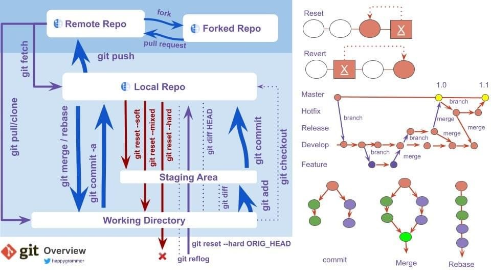
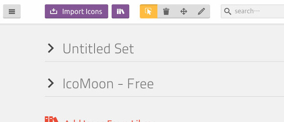
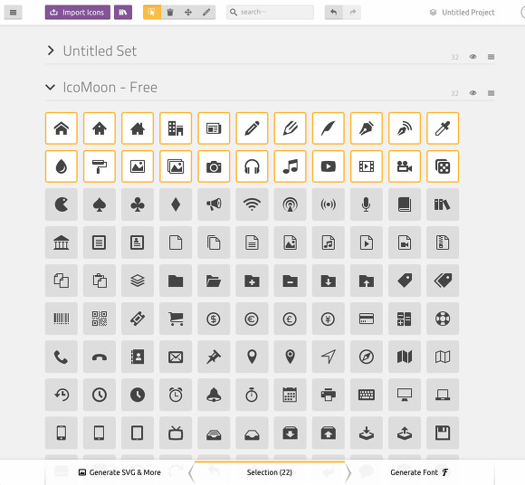
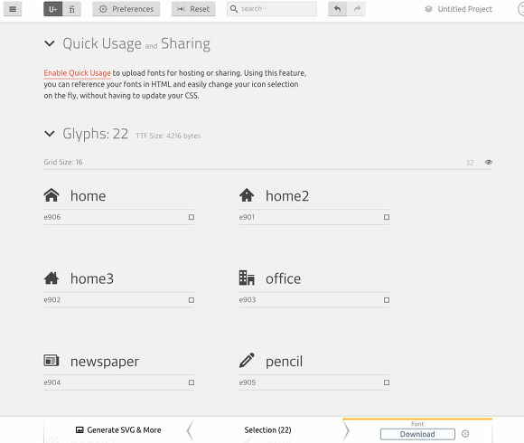

# Coding 컨벤션

------------------
## 1. HTML

### 1-1. Syntax
- 들여쓰기는 2개의 공백 문자(소프트탭)을 사용. 다른 규칙으로 통일하여 작성해도 된다.
- 모든 엘리먼트 명과 애트리뷰트 명은 케밥 표기법(kebab-case)으로 작성.
- 모든 애트리뷰트 값은 큰 따옴표(")로 감싸기.
- 주석 `<!--  --->` 처럼 기본 표기 하고 
> note : 수정사항 등을 기재하기 위한 주석 ( 주석에 년도날짜 / 수정내용 표기는 반드시 해야 한다 )
```
<!-- start: 20200330 수정 및 추가 --> 
<div> ......중략....... </div>
<!-- end : 20200330 수정 및 추가 --> 
``` 
혹은  
``` 
<!-- 20200330 수정 및 추가 -->
<div> ......중략....... </div> 
<!-- // 20200330 수정 및 추가 -->
 ```

### 1-2. Doctype
- Doctype 은 HTML5 DTD 로 선언.
`<!DOCTYPE html>`  html5 로 지정 

이어서 자기 마침 태그(Self-Closing Tags)에 후행 슬래시(/)를 사용금지.
```
<!-- Bad -->
<input />
<br />

<!-- Good -->
<input>
<br>
```

### 1-3. Metadata
```<head>```  엘리먼트의 자식 엘리먼트는 아래의 순서대로 작성.

1. Charset
2. X-UA-Compatible
3. Viewport
4. Title
5. Meta
6. Style
7. JavaScript

```
<meta charset="utf-8">
<meta http-equiv="X-UA-Compatible" content="ie=edge">
<meta name="viewport" content="width=device-width, initial-scale=1.0, maximum-scale=1.0, minimum-scale=1.0, user-scalable=no" >
<title>Hello, World!</title>
<meta content="" property="og:title">
<meta content="" property="og:url">
<meta content="" property="og:description">
<meta content="" property="og:image">
<meta content="website" property="og:type">
<meta content="" property="og:site_name">
<link rel="stylesheet" href="foo.css">
<script src="bar.js"></script>
```

A. Charset
문서의 언어셋은 UTF-8으로 선언. 
```
<meta charset="utf-8">
```

B. X-UA-Compatible
PC용 웹사이트는 최신 버전의 IE로 렌더링하기 위해 문서모드를 Edge로 선언.
```
<meta http-equiv="X-UA-Compatible" content="IE=Edge">
```

C.Viewport
모바일 기기에서 실제 렌더링되는 영역과 뷰포트의 크기를 조절. 또한 줌 레벨도 조정 가능.

```
<meta content="width=device-width, initial-scale=1.0, maximum-scale=1.0, minimum-scale=1.0, user-scalable=no" name="viewport">
```

- width=device-width : 페이지의 너비를 기기의 스크린 너비로 설정합니다. 즉, 렌더링 영역을 기기의 뷰포트의 크기와 같게 만들어 준다.
- initial-scale=1.0 : 처음 페이지 로딩시 확대/축소가 되지 않은 원래 크기를 사용하도록 합니다. 0~10 사이의 값을 가진다.
- minimum-scale : 줄일 수 있는 최소 크기를 지정. 0~10 사이의 값을 가진다.
- maximum-scale : 늘릴 수 있는 최대 크기를 지정. 0~10 사이의 값을 가진다.
- user-scalable : yes 또는 no 값을 가지며 사용자가 화면을 확대/축소  지정.

위의 줌 레벨은 1이 원래크기이고, 0.5 라면 50% 축소를 뜻한다.


### 1-4. Elements
a. 스타일 제어가 어려운 엘리먼트
  자식 엘리먼트 태그가 한정적이거나(ex. ```<table>```) 스타일 제어에 한계를 가진 엘리먼트(ex. ```<select>```)가 컴포넌트의 루트 역할로 쓰일 땐 
  나중에 발생할 유지보수를 고려해 ```<div>```나 ```<span>``` 엘리먼트로 감싸는 것을 추천.
```
<!-- Not Bad -->
<table class="table"></table>
<select class="combobox"></select>

<!-- Good -->
<div class="table">
  <table></table>
</div>
<span class="combobox">
  <select></select>
</span>
```

b. 테이블 제목
- ```<caption>``` 엘리먼트의 뷰를 숨길 때는 새로운 엘리먼트로 감싸서 숨긴다..  ```<caption>```을 바로 숨긴다면 브라우저에 따라 스타일이 깨질 수도 있다. 
테이블의 제목이 필요없거나 이미 제공되었다면 생략. 컨텐츠를 중복 제공 X 

```
<!-- Bad -->
<table>
  <caption class="blind">My Caption</caption>
</table>

<!-- Good -->
<table>
  <caption>
    <div class="blind">My Caption</div>
  </caption>
</table>
```

c. 입력 필드
회원가입 폼의 입력 필드처럼 너비, 높이가 유동적이라면 인라인 스타일로 제어. 이렇게 하면 불필요한 클래스 생성을 막을 수 있다.
```
<!-- Bad -->
<input type="text" class="input input--width-120">
<input type="text" class="input input--width-180">

<!-- Good -->
<input type="text" class="input" style="width:120px">
<input type="text" class="input" style="width:180px">
```

### 1-5. Attributes
- 애트리뷰트는 변하지 않는 것부터 먼저 선언. 애트리뷰트의 순서가 비슷한 엘리먼트끼리 통일되므로 검색하기 좋다.
-  id는 하나의 페이지 안에서 이름이 유일해야하고, name 은 중복될 수 있다.  
   따라서 따로따로 접근할 때는 id 값을 이용하고, 그룹으로 접근하고 할 때는  name 을 활용하는 식으로 편의성을 가질 수 있다. 
   하지만 대체적으로 ajax 통신을 직접하지 않고 마크업 기준으로만 작업한다면 id만 쓰는 것을 추천. 다수 선택은 class 로 사용하길~~
   (  name은 주로 form 요소로써 서버와 통신하는 목적으로 주 사용. )

```
<input class="input" type="text" id="userId" name="userId" title="아이디" style="width:100px">
<input class="input" type="password" id="userPw" name="userPw" title="비밀번호" style="width:120px">
```

a. Boolean 애트리뷰트
- HTML5에서는 Boolean 애트리뷰트를 선언하는 것 만으로도 true 값을 가진다. 필요하지 않다면 값을 작성 하지 않는게 좋다.

```
<!-- Not Bad -->
<button disabled="true"></button>

<!-- Good -->
<button disabled></button>
```

c. name 애트리뷰트
- name 애트리뷰트 값은 비즈니스 로직을 작성하는 언어의 네이밍 규칙에 맞게 작성(캐멀케이스로 작성)하는 것을 권장.
- name 이 없을시는 id 값을 캐멀케이스로 작성.
```
<!-- camelCase -->
<form class="form-group" id="myForm" name="myForm">
  <input class="input" type="text" id="myUserName" name="myUserName">
</form>
```

### 1-6. Import
- HTML5 에서 CSS 와 JS 파일을 불러올 때 type 애트리뷰트는 이미 기본값을 가진다. 필요하지 않다면 선언 X.
`<script> `엘리먼트는 가급적 `<head>` 또는 `<body>` 엘리먼트의 가장 마지막에 작성. 
( 웹브라우저는 `<script>` 엘리먼트를 만나면 처리가 끝날 때까지 HTML 파싱을 멈춘다. )

```
<!-- bad  -->
<script type="text/javascript">
    // Javascript code
</script>

<!-- good -->
<script>
    // Javascript code
</script>
```


- `<head></head>`태그 내에 로드 순서 지키기( CSS 태그를 자바스크립트 태그 앞에 두기 )
- 자바스크립트 전에 CSS 태그를 두면 브라우저의 렌더링 속도를 높이는 병렬 다운로드가 가능해 진다.

```
<!-- Not recommended -->
<script src="jquery.js"></script>
<script src="foo.js"></script>
<link rel="stylesheet" href="foo.css"/>

<!-- Recommended -->
<link rel="stylesheet" href="foo.css"/>
<script src="jquery.js"></script>
<script src="foo.js"></script>
```

## 2. CSS

> note: CSS 코드의 작성 및 규칙사항
> - CSS 파일을 압축하고, 최종 파일에서 주석, 공백, 줄바꿈을 제거한다. ( 유지 보수 및 수정 사항 전달 등에 있어서 주석 처리 예외 )
> - CSS 파일을 압축하면 클라이언트에게 더 적은 데이터를 전송하게 되며, 콘텐츠가 더 빨리 로드. 
> - CSS 파일을 압축하는 것은 중요한 이유는 대역폭과 리소스 사용을 줄이고자 하는 모든 부분에 있어서 도움이 된다.

### preload
- preload 를 통해 브라우저가 페이지의 콘텐츠를 보여지기 전에 CSS 파일을 로드할 수 있다.
- rel 속성의 값을 preload 로 주고, as="style" 를 `<link>` 태그에 넣는다.
- 참고 URL : [리소스 우선순위 지정](https://developers.google.com/web/fundamentals/performance/resource-prioritization?hl=ko)

```
<link rel="preload" href="style.min.css" as="style" onload="this.rel='stylesheet'">
```


### 2-1. Syntax
- Lint 의 사용을 권장!
- css class 이름은 케밥 표기법 ( kebab-case )으로 작성. 알파벳(대소문자)로 시작하되 숫자/특수문자로 시작하여선 안된다.
- css id 는 캐멀 케이스 ( Camel case )방식으로 이름을 명기한다.
- 들여쓰기는 2개의 공백 문자(소프트탭)을 사용. 다른 규칙으로 통일하여 작성해도 된다.
- 프로퍼티는 되도록 한 줄에 하나씩 작성. 
- 프로퍼티는 영문 소문자로 작성.
- 일반적으로 작은 따옴표(')를 사용하지만 @charset 선언과 타입 선택자는 큰 따옴표(")를 사용. 가능하다면 생략하는 것이 가장 좋다.
- 사용되지 않는 CSS 선택자는 제거

### 2-2. Charset
- 문서의 언어셋은 UTF-8으로 최상위에 선언. 
- 언어셋이 정해진 번들링 파일이라면 선언하지 않는다.

```
@charset "UTF-8";
```

### 2-3. Selectors
- 태그이름과 선택자는 가급적 중첩하지 않는다. 
- Indentation Depth 는 3 Depth 까지, 가급적 1 Depth 만을 사용하는 것을 권장한다.


### 2-4. z-index
- z-index 스택을 0부터 규칙 없이 쌓는다면 순서가 꼬인다. 엘리먼트의 특성에 맞게 계층을 분리하여 체계적으로 관리하는 것이 좋은 방법.
- CSS 전처리기의 믹스인을 활용한다면 간편하게 작성할 수 있다.

```
/* scss */
.foo {
  position: absolute;
  @include layer-index('floating', 3000);
}

/* css */
.foo {
  z-index: 16203000
}
```


### 2-5. Import
CSS 의 기본 문법인 @import 는 성능 문제를 가지고 있다. 사용 X.

- 여러개의 ```<link>``` 엘리먼트로 작성하기
- 하나의 CSS 파일로 작성하기
  - CSS 전처리기의 @import 문법을 사용하기
  - 번들러 등의 도구를 이용하여 하나의 CSS 파일로 병합하기

```
  <!-- Too Bad -->
  <style>
    @import url("one.css");
    @import url("two.css");
    @import url("three.css");
  </style>
  
  <!-- Good -->
  <link rel="stylesheet" href="one.css">
  <link rel="stylesheet" href="two.css">
  <link rel="stylesheet" href="three.css">
  
  <!-- Very Nice -->
  <link rel="stylesheet" href="bundle.css"> <!-- one.css, .. in bundle.css -->
```

### 2-6. Media Query
- 미디어 쿼리는 컴포넌트 단위로 분류하여 관련 규칙 바로 뒤에 작성.
혹은 문서의 마지막에 모아서 작성.

```
.foo-a {}
.foo-b {}
@media (min-width: 768px) {
  .foo-a {}
  .foo-b {}
}

.bar {}
.foo-a {}
.foo-b {}

.bar {}

@media (min-width: 768px) {
  .foo-a {}
  .foo-b {}
}
```

### 2-7. Nesting(중첩)
- 너무 많은 선택자의 중첩은 피해야 하므로, CSS 전처리기가 지원하는 Nesting 문법은 주의해서 사용해야 한다!


```
/* Bad */
.foo {
  .bar {
    color: #abc;
  }
}

/* Good */
.foo__bar {
  color: #abc;
}
```

### 2-8. Extend
- CSS 전처리기가 지원하는 Extend 문법은  사용하지 X.  Mixin 으로 대체!

### 2-9. Reset
- 초기화 스타일은 서비스에 맞게 정의. 만약 normalize.css 또는 Bootstrap 등의 프레임워크를 사용한다면 초기화를 생략.

### 2-10. Vendor Prefix
- 벤더 프리픽스 프로퍼티는 일반 프로퍼티보다 먼저 선언.


```
/* Bad */
.foo {
  box-shadow: 0 1px 2px rgba(0, 0, 0, .15);
  -webkit-box-shadow: 0 1px 2px rgba(0, 0, 0, .15);
}
/* Good */
.foo {
  -webkit-box-shadow: 0 1px 2px rgba(0, 0, 0, .15);
  box-shadow: 0 1px 2px rgba(0, 0, 0, .15);
}
```


### 2-11. Naming
- 접두사가 2개 이상 중복 시 기능적인 접두사가 맨 앞부분에 위치할 수 있도록 한다.
- 단독사용 클래스는 지양하며 접두사를 조합한 형태로 작성한다.
- on 클래스인 경우, 단일 특정요소에 상태변화 클래스를 적용한다면 접미사로서 적용한다.

| ClassName	   |     | Description          |     |
| :-----------------|-----|----------------------|-----|
| wrap / cnt  |     | 일반 영역의 묶음 - ex) btn-cnt / btn-wrap  |     |
| group  |     | 같은 엘리먼트 묶음 - ex) btn 3개를 묶는 경우 ```<div class="btn-group"><button class="btn">버튼</button><button class="btn">버튼</button><button class="btn">버튼</button></div>``` |     |
| inner |     | 부모 wrapper 가 존재하며 자식 묶음이 단독으로 사이즈가 필요한 경우 |     |
| img-cnt  |     | 이미지를 감싸는 경우 |     |
| txt-cnt  |     | 텍스트를 감싸는 경우 |     |
| m-tit |     | 메인페이지 타이틀(중) 텍스트 |     |
| s-tit  |     | 메인페이지 타이틀(소) 텍스트 |     |
| tit-sub   |     | 서브페이지 타이틀(대) 텍스트 |     |
| m-tit-sub   |     | 서브페이지 타이틀(중) 텍스트 |     |
| s-tit-sub   |     | 서브페이지 타이틀(소) 텍스트 |     |
| tit  |     | 타이틀 텍스트 |     |
| desc |     | 상세 내용 |     |
| txt-date  |     | 날짜 |     |
| btn-cnt |     | 버튼을 감싸는 경우 |     |
| list-cnt |     | 리스트를 감싸는 경우(ul) |     |
| tab |     | 탭 메뉴 |     |


### 2-12. 유용한 tip

```
html {
-webkit-touch-callout:none;
-webkit-user-select:none;
-webkit-tap-highlight-color:rgba(0, 0, 0, 0);
}
```


- `webkit-touch-callout` 는 아이폰에서만 적용된다. 롱프레스시 새로운탭에서 열기, 읽기목록 추가, 복사하기, 공유 등 하단에 나오는 ios 네이티브 메뉴바 설정. none 으로 할 때 나오지 않게 됨.
- `webkit-user-select ` 는 모바일웹에서 엘리먼트 드래그 방지용. 특히 텍스트 같은 경우 드래그 해서 선택 방지시에 많이 사용.
- `webkit-tap-highlight-color` 는 롱프레스시에 해당 엘리먼트가 파랗게 선택되어 보여지는 것을 방지.


-------

## 3. SCSS
> note :
> - 중첩( Nesting )은 웬만하면 4depth 이하로 작성.
> - import : 공통 파일을 기능 별로 나누어 _(언더스코어) 붙여서 분할된 파일( partial ) 로 구성한다. ( 컴파일시엔 merge 되어 파일 하나로 볼 수 있다. )
> - extend : 되도록이면 mixin 으로 사용하는 게 좋다.
> - 함수 : 자주 사용하는 계산 값에 대해 사용.

1. 기능 별 분리
- _component.scss 의 경우 공통 컴포넌트의 집합체이기에 많은 수의 컴포넌트가 존재한다.
기능 별로 분리할 필요가 있다. 대표적으로 _variable(공통 변수), _button, _input, _form


### 3-1. Variables (변수)
- sass에서 변수라는 기능을 제공하는 이유는 재사용성을 위함이다. 변수로 등록된 스타일은 쉽게 다른 코드에서 사용할 수 있기 때문이다.

```

    $font-stack : Helvetical, sans-serif;
    $primary-color : #333;


    body{
        font : 100% &font-stack;
        color: $primary-color;
    }

```

### 3-2. Nesting (중첩)
- 부모 요소를 반복적으로 작성하던 불편함을 해결한다.
- 대부분의 스타일 가이드는 최대 깊이를 4로 설정. 가급적 4depth 이내의 중첩 구조를 갖도록 하는 것이 좋다.


### 3-3. Partials (파일분할)
- 공식문서에 따르면, scss의 파일 구조를 모듈화 할 수 있다. 하지만, 아까 처음 명령어를 통해서 모듈화된 코드가 있다고 가정했을 때 이를 나누어 모듈화 시킬 scss를 제외하고 scss만 컴파일 하기에는 상당히 고생할 수도 있다. 
따라서 ***   _partial.scss 처럼 파일 명 앞에 언더 스코어 바를 통해서 빌드에서 제외 시킬 수 있다.   ***


### 3-4. Mixins (재활용)
- 믹스 인을 통해서, 사이트 전체에서 재사용할 CSS declarations를 만들 수 있다. 또한, 값들을 믹스인을 통해서 집어 넣을 수 있으며(파라미터), 이를 통해서 좀더 유연하고 동적인 CSS 구조를 만들 수 있다.

```
/* _mixin.scss */
    @mixin transform($property) {		      
        -webkit-transform: $property;
        -ms-transform: $property;
        transform: $property;
    }

/* _ex.scss */
    .box { @include transform(rotate(30deg)); } 
```

```
/* _mixin.scss */
    @mixin columnWidth( $selector ){          
        &[data-column="2"]{
            #{$selector}{width:50%;}
        }
        &[data-column="3"]{
        #{$selector}{width:33.33333%;}
        }
    }

/* _button.scss */
    .btn-group[data-column]{			     
          width:100%;
          display: flex;
          flex-wrap: wrap;
          @include columnWidth('.btn');
    
         &[data-column="2"]{
            @include rowChild( 2, '.btn');
          }
         &[data-column="3"]{
           @include rowChild( 3, '.btn');
         }
     }
```

믹스인을 만들기 위해 해야 되는 절차는 다음과 같다.
> - @mixin 지시문을 앞에 사용,
> - 함수의 파라미터처럼 ($변수) 이름 정의
> - mixin 지시문을 사용하고 이름을 지정
> - 이를 사용할때에는 @include를 통해서 사용할 수 있다. (반응형을 위한 미디어 쿼리 작성 또한 이를 통해서 진행 할 수 있다. )


### 3-5. Function (함수)

- 자신의 함수를 정의하여 사용할 수 있다.
- 함수와 Mixins은 거의 유사하지만 반환되는 내용이 다르다.
- Mixin은 지정한 스타일(Style)을 반환하는 반면, 함수는 보통 연산된(Computed) 특정 값을 @return 지시어를 통해 반환한다.

```

// Mixins
@mixin 믹스인이름($매개변수) {
  스타일;
}

// Functions
@function 함수이름($매개변수) {
  @return 값
}

```

함수는 함수이름으로 바로 사용한다. (Mixin은 @include 지시어를 사용)

```

// Mixin
@include 믹스인이름(인수);

// Functions
함수이름(인수)

```

아래 예시와 같이 함수는 @include 같은 별도의 지시어 없이 사용하기 때문에 내가 지정한 함수와 내장 함수(Built-in Functions)의 이름이 충돌할 수 있다. 따라서 내가 지정한 함수에는 별도의 접두어를 붙여주는 것이 좋다.

```

// SCSS:

$max-width: 980px;

@function columns($number: 1, $columns: 12) {
  @return $max-width * ($number / $columns)
}

.box_group {
  width: $max-width;

  .box1 {
    width: columns();  // 1
  }
  .box2 {
    width: columns(8);
  }
  .box3 {
    width: columns(3);
  }
}


// Compiled to:

.box_group {
  /* 총 너비 */
  width: 980px;
}
.box_group .box1 {
  /* 총 너비의 약 8.3% */
  width: 81.66667px;
}
.box_group .box2 {
  /* 총 너비의 약 66.7% */
  width: 653.33333px;
}
.box_group .box3 {
  /* 총 너비의 25% */
  width: 245px;
}

```

 예를 들어, 색의 빨강 성분을 가져오는 내장 함수로 이미 red()가 있다면, 접두어를 붙여 extract-red() 같은 이름을 만들 수 있다.


```

@function extract-red($color) {
  // 내장 함수
  @return rgb(red($color), 0, 0);
}

div {
  color: extract-red(#D55A93);
}

```


### 3-6. If (조건문)

필요한 경우가 아니라면 괄호 없이 사용 한다.

```

<!-- bad -->
@if ($support-legacy == true) {
  // …
}
@else {
  // …
}


<!-- good -->
@if $support-legacy {
  // …
} @else {
  // …
}

```

거짓 값을 테스트 하는 경우에 false, null 대신에 not 키워드를 사용 한다.
```

<!-- bad -->
@if index($list, $item) == null {
  // …
}

<!-- good -->
@if not index($list, $item) {
  // …
}

```

언제나 변수 부분을 조건문의 왼쪽에, 기대되는 (혹은 기대되지 않는) 결과를 오른쪽에 배치 한다.
```

<!-- bad -->
@if 42 == $value {
  // …
}

<!-- good -->
@if $value == 42 {
  // …
}

```

조건에 따라 다른 결과를 반환하는 함수 안에서 조건문을 사용할 때는, 반드시 함수가 조건문 블록 밖에서도 @return문을 갖도록 해야 한다.
```

<!-- bad -->
@function dummy($condition) {
  @if $condition {
    @return true;
  } @else {
    @return false;
  }
}

<!-- good -->
@function dummy($condition) {
  @if $condition {
    @return true;
  }

  @return false;
}

```

### 3-7. For (반복문)
- @for는 스타일을 반복적으로 출력한다.
- 변수는 관례상 $i 를 사용한다.
- through를 사용하는 형식과 to를 사용하는 형식으로 나뉜다.

```
// SCSS

// through를 사용하는 경우(1부터 3번 이하 반복)
@for $i from 1 through 3 {
  .through:nth-child(#{$i}) {
    width : 20px * $i
  }
}


// Compiled to:

.through:nth-child(1) { width: 20px; }
.through:nth-child(2) { width: 40px; }
.through:nth-child(3) { width: 60px; }


```


```
// SCSS

// to를 사용하는 경우(1부터 3번 미만, 2번 반복)
@for $i from 1 to 3 {
  .to:nth-child(#{$i}) {
    width : 20px * $i
  }
}


// Compiled to:

.to:nth-child(1) { width: 20px; }
.to:nth-child(2) { width: 40px; }

```

ex)
```
// SCSS


$total:500;

@for $i from 0 through $total {
  $unit: if($i == 0,  !important, px !important);

  .mgt-#{$i} {
    margin-top:  #{$i}#{$unit};
  }
  .mgb-#{$i} {
    margin-bottom:  #{$i}#{$unit};
  }
}


// Compiled to:

.mgt-0 {
  margin-top: 0!important;
}

.mgb-0 {
  margin-bottom: 0!important;
}

......중략.......


.mgt-500 {
  margin-top: 500px !important;
}

.mgb-500 {
  margin-bottom: 500px !important;
}

```


---------


## 4. Javascript
### 1. javascript Naming convention

#### 일관성을 유지
```
/* Bad */
const pages_count = 5
const shouldUpdate = true


/* Good */
const pageCount = 5
const shouldUpdate = true


/* Good as well */
const page_count = 5
const should_update = true
```


#### **S-I-D( Short - Intutitive - Descriptive )**
이름은 짧고 직관적이며 설명적이어야 한다.
* Short( 짧은 ). 이름을 입력하는 데 시간이 오래 걸리지 않으므로 기억해야 한다.
* Intutitive( 직관적 ). 이름은 가능한 한 일반적인 연설에 가깝게 자연스럽게 읽어야 한다.
* Descriptive( 설명 ). 이름은 가장 효율적인 방식으로 수행/소유하는 것을 반영해야 한다.

```
/* Bad */
const a = 5 // "a" could mean anything
const isPaginatable = a > 10 // "Paginatable" sounds extremely unnatural
const shouldPaginatize = a > 10 // Made up verbs are so much fun!


/* Good */
const postCount = 5
const hasPagination = postCount > 10
const shouldDisplayPagination = postCount > 10 // alternatively
```


#### **축소 방지 ( Avoid contractions )**
네이밍 축소. 즉 너무 짧게 줄여서 약어처럼 사용하지 않게 하기.
- 코드의 가독성을 떨어뜨리는 것 외에는 아무 것도 기여하지 않는다.


```
/* Bad */
const onItmClk = () => {}

/* Good */
const onItemClick = () => {}
```


#### **컨텍스트 중복 방지( Avoid context duplication )**
- 이름은 정의된 컨텍스트와 중복되어서는 안된다. 가독성이 떨어지지 않는다면 항상 이름에서 컨텍스트를 제거.

```
class MenuItem {
  /* 메서드 이름이 컨텍스트("MenuItem")와 중복.*/
  handleMenuItemClick = (event) => { ... }

  /*  `MenuItem.handleClick()` 처럼 쓰는게 훨씬 좋아보인다. */
  handleClick = (event) => { ... }
}
```

#### **예상 결과 반영 (Reflect the expected result)**
- 이름은 예상 결과를 반영해야 합니다.

```
const isEnabled = itemCount > 3
return <Button disabled={!isEnabled} />

/* Good */
const isDisabled = itemCount <= 3
return <Button disabled={isDisabled} />
```
/* Bad */


#### **Naming functions**
- 함수의 이름을 지정할 때 따라야 할 유용한 패턴.

**A/HC/LC Pattern**
- prefix? + action (A) + high context (HC) + low context? (LC)

Take a look at how this pattern may be applied in the table below.

| Name | Prefix | Action (A) | High context (HC) |	Low context (LC) |
|:---- |:---- |:---- |:---- |:---- |
| getPost		             |---| get | Post | --- |
| getPostData		         |---| get | Post | Data |
| handleClickOutside		 |---| handle |	Click | Outside |
| shouldDisplayMessage | should |	Display | Message | --- |	

> - Note: 참고: 컨텍스트의 순서는 변수의 의미에 영향을 준다.
> 예를 들어 shouldUpdateComponent 는 구성 요소를 업데이트하려고 함을 의미.
> shouldComponentUpdate 는 구성 요소가 자체적으로 업데이트된다는 것을 알려줍니다. 
> 업데이트해야 하는 시기를 제어하는 것 뿐이다. 즉, 상위 컨텍스트는 변수의 의미를 강조.

---------

##### **1. Actions**
- 함수 이름의 동사 부분이다. 함수가 하는 일을 설명하는 가장 중요한 부분.

**get** 
데이터에 즉시 액세스 (즉, 내부 데이터의 약식 getter).

```
function getFruitCount() {
  return this.fruits.length
}
```


**set**
- 값 A를 값 B로 사용하여 선언적 방식으로 변수를 설정한다.

```
let fruits = 0
function setFruits(nextFruits) {
  fruits = nextFruits
}
setFruits(5)
console.log(fruits) // 5
```

**reset**
- 변수를 초기 값 또는 상태로 다시 설정한다.

```
const initialFruits = 5
let fruits = initialFruits
setFruits(10)
console.log(fruits) // 10

function resetFruits() {
  fruits = initialFruits
}

resetFruits()
console.log(fruits) // 5
```

**fetch**
-  비동기 요청 즉, 불확실한 시간이 소요되는 일부 데이터 요청
function fetchPosts(postCount) {
  return fetch('https://api.dev/posts', {...})
}

**remove**
- 무언가를 제거
예를 들어 검색 페이지에 선택된 필터 컬렉션이 있는 경우 컬렉션에서 필터 중 하나를 제거하는 것은 deleteFilter 가 아니라 removeFilter 이다.

```
function removeFilter(filterName, filters) {
  return filters.filter((name) => name !== filterName)
}
const selectedFilters = ['price', 'availability', 'size']
removeFilter('price', selectedFilters)
```


**delete**
- 무언가를 완전히 삭제.
없애고 싶은 게시물이 있을 때  "게시물 삭제" 버튼을 클릭시 메서드 네이밍 및 기능은 removePost 가 아닌 deletePost 작업을 수행해야 한다.

```
function deletePost(id) {
  return database.find({ id }).delete()
}
```


**compose**
- 기존 데이터에서 새 데이터를 생성한다. 주로 문자열, 개체 또는 함수에 적용할 수 있다.

```
function composePageUrl(pageName, pageId) {
  return `${pageName.toLowerCase()}-${pageId}`
}
```


**handle**
이벤트 handle 을 처리한다.  콜백 메서드의 이름을 지정할 때 자주 사용됩니다.

```
function handleLinkClick() {
  console.log('Clicked a link!')
}
link.addEventListener('click', handleLinkClick)
```


---------


##### **2. Context**
함수가 작동하는 도메인( 범위 ).
함수는 종종 무언가에 대한 작업이기에 작동 가능한 도메인이 무엇인지 또는 최소한 예상되는 데이터 유형을 명시하는 것이 중요.

```
/* 프리미티브로써 작동하는 순수 함수 */
function filter(predicate, list) {
  return list.filter(predicate)
}

/* 게시물에서만 정확히 작동하는 기능 */
function getRecentPosts(posts) {
  return filter(posts, (post) => post.date === Date.now())
}
```

일부 언어 특유적으로 컨텍스트를 생략할 수 있다. 예를 들어, JavaScript 에서는 필터가 Array 에서 작동하는 것이 일반적.
명시적 filterArray 와 같이 Array 를 추가할 필요가 없다.

-----------

##### **3. Prefixes**
- 접두사는 변수의 의미를 향상시킨다. 함수 이름에는 거의 사용되지 않는다.

**is**
- 현재 컨텍스트(일반적으로 boolean)의 특성 또는 상태를 설명.

```
const color = 'blue'
const isBlue = color === 'blue' // characteristic
const isPresent = true // state

if (isBlue && isPresent) {
  console.log('Blue is present!')
}
```

**has**
- 현재 컨텍스트가 특정 값 또는 상태(보통 부울)를 소유하는지 여부를 설명.

```
/* Bad */
const isProductsExist = productsCount > 0
const areProductsPresent = productsCount > 0

/* Good */
const hasProducts = productsCount > 0
```

**should**
- 특정 작업과 결합된 긍정적인 조건문(보통 부울)을 반영.

```
function shouldUpdateUrl(url, expectedUrl) {
  return url !== expectedUrl
}
```


**min/max**
- 최소값 또는 최대값을 나타낸다. 경계 또는 한계를 설명할 때 사용.

```
/**
 * Renders a random amount of posts within
 * the given min/max boundaries.
 */
function renderPosts(posts, minPosts, maxPosts) {
  return posts.slice(0, randomBetween(minPosts, maxPosts))
}
```

**prev/next**
- 현재 컨텍스트에서 변수의 이전/다음 상태 전환을 설명할 때 사용.


```
function fetchPosts() {
  const prevPosts = this.state.posts

  const fetchedPosts = fetch('...')
  const nextPosts = concat(prevPosts, fetchedPosts)

  this.setState({ posts: nextPosts })
}
```

#### **단수 / 복수 ( Singular and Plurals )**
- 접두사와 마찬가지로 변수 이름은 단일 값 또는 여러 값을 보유하는지 여부에 따라 단수 또는 복수로 만들 수 있다.

```
/* Bad */
const friends = 'Bob'
const friend = ['Bob', 'Tony', 'Tanya']

/* Good */
const friend = 'Bob'
const friends = ['Bob', 'Tony', 'Tanya']
```
----------


## 5. Typescript

- 에러 or tip
- 중첩된 Scope 에 기존의 변수 이름을 사용하는 것을 Shadow
- api 통신하는 객체는 interface 로 구조를 잡는다.
- let 과 const 중 어떤 것을 사용할지 스스로 선택. 
- 최소 권한의 원칙(Principle of least privilege)을 적용하면 수정하려는 모든 선언은 const 를 사용한다.

- 조건 연산자 
`! -> Nullable 이다. `
느낌표를 붙이면 null 과 undefined 를 허용한다. 즉 초기화 하지 않아도 된다.

`? -> Optional 이라고 한다. `
말그대로 필수값이 아닌 옵셔널한 값이라는 뜻.

------------


### **유니온(Union)타입**
유니온 타입은 하나의 프로퍼티에 다양한 변수가 올 수 있는 타입을 말한다.

```let someValue: number | string```

위에서 변수 someValue 는 숫자 값으로도 할당할 수 있고 문자열로도 할당할 수 있다.

```let someValue: "a" | "b" | "c"```

```
function padLeft(value: string, padding: string | number) {
  // ...
}
let indentedString = padLeft("Hello world", true);


interface Bird {
  fly(): void;
  layEggs(): void;
}

interface Fish {
  swim(): void;
  layEggs(): void;
}

declare function getSmallPet(): Fish | Bird;

let pet = getSmallPet();
pet.layEggs();

// 두 개의 잠재적인 타입 중 하나에서만 사용할 수 있습니다.
pet.swim();

```

------------

### **교차 타입 (Intersection Types)**

교차 타입은 유니언 타입과 밀접한 관련이 있지만, 사용 방법은 매우 다르다. 교차 타입은 여러 타입을 하나로 결합한다. 
기존 타입을 합쳐 필요한 기능을 모두 가진 단일 타입을 얻을 수 있다. 
예를 들어, Person & Serializable & Loggable 은 Person 과 Serializable 그리고 Loggable 이다.
즉, 이 타입의 객체는 세 가지 타입의 모든 멤버를 갖게 됩니다.

예를 들어, 일관된 에러를 다루는 여러 네트워크 요청이 있다면 해당 에러 핸들링을 분리하여 하나의 응답 타입에 대응하는 결합된 자체 타입으로 만들 수 있다.

```
interface ErrorHandling {
  success: boolean;
  error?: { message: string };
}

interface ArtworksData {
  artworks: { title: string }[];
}

interface ArtistsData {
  artists: { name: string }[];
}

// 이 인터페이스들은
// 하나의 에러 핸들링과 자체 데이터로 구성됩니다.

type ArtworksResponse = ArtworksData & ErrorHandling;
type ArtistsResponse = ArtistsData & ErrorHandling;

const handleArtistsResponse = (response: ArtistsResponse) => {
  if (response.error) {
    console.error(response.error.message);
    return;
  }

  console.log(response.artists);
};
```

------------


### **교차를 통한 믹스인 (Mixins via Intersections)**

```
class Person {
  constructor(public name: string) {}
}
interface Loggable {
  log(name: string): void;
}
class ConsoleLogger implements Loggable {
  log(name: string) {
    console.log(`Hello, I'm ${name}.`);
  }
}

// 두 객체를 받아 하나로 합칩니다.
function extend<First extends {}, Second extends {}>(
  first: First,
  second: Second
): First & Second {
  const result: Partial<First & Second> = {};
  for (const prop in first) {
    if (first.hasOwnProperty(prop)) {
      (result as First)[prop] = first[prop];
    }
  }
  for (const prop in second) {
    if (second.hasOwnProperty(prop)) {
      (result as Second)[prop] = second[prop];
    }
  }
  return result as First & Second;
}

const jim = extend(new Person("Jim"), ConsoleLogger.prototype);
jim.log(jim.name);
```

------------


### **상속 (Inheritance)**

```
class Animal {
    name: string;
    constructor(theName: string) { this.name = theName; }
    move(distanceInMeters: number = 0) {
        console.log(`${this.name} moved ${distanceInMeters}m.`);
    }
}

class Snake extends Animal {
    constructor(name: string) { super(name); }
    move(distanceInMeters = 5) {
        console.log("Slithering...");
        super.move(distanceInMeters);
    }
}

class Horse extends Animal {
    constructor(name: string) { super(name); }
    move(distanceInMeters = 45) {
        console.log("Galloping...");
        super.move(distanceInMeters);
    }
}

let sam = new Snake("Sammy the Python");
let tom: Animal = new Horse("Tommy the Palomino");

sam.move();
tom.move(34);

//아래 코멘트는 결과 
//Slithering...
//Sammy the Python moved 5m.
//Galloping...
//Tommy the Palomino moved 34m.
```


------------


### **기본적으로 공개 (Public by default)**

```
class Animal {
    public name: string;
    public constructor(theName: string) { this.name = theName; }
    public move(distanceInMeters: number) {
        console.log(`${this.name} moved ${distanceInMeters}m.`);
    }
}
```

------------


### **비공개( private )**

```
class Animal {
    private name: string;
    constructor(theName: string) { this.name = theName; }
}

class Rhino extends Animal {
    constructor() { super("Rhino"); }
}

class Employee {
    private name: string;
    constructor(theName: string) { this.name = theName; }
}

let animal = new Animal("Goat");
let rhino = new Rhino();
let employee = new Employee("Bob");

animal = rhino;
animal = employee; // 오류: 'Animal'과 'Employee'은 호환될 수 없음.
```

------------


### **멤버 공개 ( protected )**

- 아래 소스에서 Person 클래스의  name 은 사용할 수 없지만, Employee 클래스에서는 Person 에서 파생되었기 때문에 Employee 의 인스턴스 메서드 내에서는 사용 가능.

```
class Person {
    protected name: string;
    constructor(name: string) { this.name = name; }
}

class Employee extends Person {
    private department: string;

    constructor(name: string, department: string) {
        super(name);
        this.department = department;
    }

    public getElevatorPitch() {
        return `Hello, my name is ${this.name} and I work in ${this.department}.`;
    }
}

let howard = new Employee("Howard", "Sales");
console.log(howard.getElevatorPitch());
console.log(howard.name); // 오류
```

생성자 또한 protected 로 표시될 수도 있다. 이는 클래스를 포함하는 클래스 외부에서 인스턴스화 할 수 없지만 확장 할 수 있음을 의미.

```
class Person {
    protected name: string;
    protected constructor(theName: string) { this.name = theName; }
}

// Employee는 Person을 확장할 수 있다.
class Employee extends Person {
    private department: string;

    constructor(name: string, department: string) {
        super(name);
        this.department = department;
    }

    public getElevatorPitch() {
        return `Hello, my name is ${this.name} and I work in ${this.department}.`;
    }
}

let howard = new Employee("Howard", "Sales");
let john = new Person("John"); // 오류: 'Person'의 생성자는 protected 이다.
```

------------


### **읽기전용 (Readonly modifier)**

`readonly`키워드를 사용하여 프로퍼티를 읽기전용으로 만들 수 있다. 
읽기전용 프로퍼티들은 선언 또는 생성자에서 초기화해야 한다.

```
class Octopus {
    readonly name: string;
    readonly numberOfLegs: number = 8;
    constructor (theName: string) {
        this.name = theName;
    }
}
let dad = new Octopus("Man with the 8 strong legs");
dad.name = "Man with the 3-piece suit"; // 오류! name은 읽기전용.
```

------------


### **get/set 접근자 (Accessors)**
체의 멤버에 대한 접근을 가로채는 방식으로 getters/setters를 지원한다. 이를 통해 각 객체의 멤버에 접근하는 방법을 세밀하게 제어할 수 있다.

```
const fullNameMaxLength = 10;

class Employee {
    private _fullName: string;
    get fullName(): string {
        return this._fullName;
    }
    set fullName(newName: string) {
        if (newName && newName.length > fullNameMaxLength) {
            throw new Error("fullName has a max length of " + fullNameMaxLength);
        }
        this._fullName = newName;
    }
}
let employee = new Employee();
employee.fullName = "Bob Smith";
if (employee.fullName) {
    console.log(employee.fullName);
}
```

------------


### **전역 프로퍼티 (Static Properties)**
인스턴스가 아닌 클래스 자체에서 보이는 전역 멤버를 생성할 수 있다. 
아래 예제에서 모든 grid 의 일반적인 값이기 때문에 origin 에 static 을 사용한다. 
각 인스턴스는 클래스 이름을 앞에 붙여 이 값에 접근할 수 있다. 
인스턴스 접근 앞에 this.를 붙이는 것과 비슷하게 여기선 전역 접근 앞에 Grid.를 붙인다.

```
class Grid {
    static origin = {x: 0, y: 0};
    calculateDistanceFromOrigin(point: {x: number; y: number;}) {
        let xDist = (point.x - Grid.origin.x);
        let yDist = (point.y - Grid.origin.y);
        return Math.sqrt(xDist * xDist + yDist * yDist) / this.scale;
    }
    constructor (public scale: number) { }
}

let grid1 = new Grid(1.0);  // 1x scale
let grid2 = new Grid(5.0);  // 5x scale

console.log(grid1.calculateDistanceFromOrigin({x: 10, y: 10}));
console.log(grid2.calculateDistanceFromOrigin({x: 10, y: 10}));
```

------------


### **추상 클래스 (Abstract Classes)**
추상 클래스는 다른 클래스들이 파생될 수 있는 기초 클래스이다. 
추상 클래스는 직접 인스턴스화할 수 없다. **추상 클래스는 인터페이스와 달리 멤버에 대한 구현 세부 정보를 포함할 수 있다**. 
abstract 키워드는 추상 클래스뿐만 아니라 추상 클래스 내에서 추상 메서드를 정의하는데 사용된다.
```
abstract class Animal {
    abstract makeSound(): void;
    move(): void {
        console.log("roaming the earth...");
    }
}
```

추상 클래스 내에서 추상으로 표시된 메서드는 구현을 포함하지 않으며 반드시 파생된 클래스에서 구현되어야 한다. 
추상 메서드는 인터페이스 메서드와 비슷한 문법을 공유한다. 둘 다 메서드 본문을 포함하지 않고 메서드를 정의한다. 
그러나 **추상 메서드는 반드시 abstract 키워드를 포함해야 하며, 선택적으로 접근 지정자를 포함할 수 있다**.

```
abstract class Department {
    constructor(public name: string) {
    }
    printName(): void {
        console.log("Department name: " + this.name);
    }
    abstract printMeeting(): void; // 반드시 파생된 클래스에서 구현되어야 합니다.
}
class AccountingDepartment extends Department {
    constructor() {
        super("Accounting and Auditing"); // 파생된 클래스의 생성자는 반드시 super()를 호출해야 합니다.
    }
    printMeeting(): void {
        console.log("The Accounting Department meets each Monday at 10am.");
    }
    generateReports(): void {
        console.log("Generating accounting reports...");
    }
}

let department: Department; // 추상 타입의 레퍼런스를 생성합니다
department = new Department(); // 오류: 추상 클래스는 인스턴스화 할 수 없습니다
department = new AccountingDepartment(); // 추상이 아닌 하위 클래스를 생성하고 할당합니다
department.printName();
department.printMeeting();
department.generateReports(); // 오류: 선언된 추상 타입에 메서드가 존재하지 않습니다
```

------------


### **열거형 (Enums)**
열거형으로 이름이 있는 상수들의 집합을 정의할 수 있다. 
열거형을 사용하면 의도를 문서화 하거나 구분되는 사례 집합을 더 쉽게 만들수 있다. 
TypeScript 는 숫자와 문자열-기반 열거형을 제공한다.

- **숫자 열거형 (Numeric enums)**

```
//원한다면, 전부 초기화 하지 않을 수도 있다:
enum Direction {
    Up = 1,
    Down,
    Left,
    Right,
}
//위 코드에서 Up이 1 로 초기화된 숫자 열거형을 선언. 
//그 지점부터 뒤따르는 멤버들은 자동으로-증가된 값을 갖는다. 
//즉 Direction.Up 은 1, Down 은 2, Left 는 3, Right 은 4 을 값으로 가진다.
```

- **문자열 열거형 (String enums)**
문자열 열거형은 유사한 개념이지만 아래 설명된 것과 같이 런타임에서 열거형의 동작이 약간 다르다.
문자열 열거형에서 각 멤버들은 문자열 리터럴 또는 다른 문자열 열거형의 멤버로 상수 초기화 해야 한다.

문자열 열거형은 숫자 열거형처럼 자동-증가하는 기능은 없지만, "직렬화"를 잘한다는 이점이 있다. 
다시 말해서 숫자 열거형을 이용해서 디버깅하고 있고 그 값을 읽어야 한다면, 종종 그 값이 불확실한 경우가 있다 - 숫자만으로는 이것이 어떤 의미인지 유의미한 정보를 제공해주지 않기 때문이다.
반면 문자열 열거형을 이용하면 코드를 실행할 때, 열거형 멤버에 지정된 이름과는 무관하게 유의미하고 읽기 좋은 값을 이용하여 실행할 수 있다.

```
enum Direction {
    Up = "UP",
    Down = "DOWN",
    Left = "LEFT",
    Right = "RIGHT",
}
```

> note: 기술적으로 열거형은 숫자와 문자를 섞어서 사용할 수 있지만 굳이 그렇게 할 이유는 없다.

------------


### **다형성 this 타입 (Polymorphic this types)**

```
class BasicCalculator {
    public constructor(protected value: number = 0) { }
    public currentValue(): number {
        return this.value;
    }
    public add(operand: number): this {
        this.value += operand;
        return this;
    }
    public multiply(operand: number): this {
        this.value *= operand;
        return this;
    }
    // ... 다른 연산들은 여기에 작성 ...
}

let v = new BasicCalculator(2)
            .multiply(5)
            .add(1)
            .currentValue();

//클래스가 this 타입을 사용하기 때문에, 이를 extend 할 수 있고 새로운 클래스가 아무 변경 없이 이전 메서드를 사용할 수 있다.
class ScientificCalculator extends BasicCalculator {
    public constructor(value = 0) {
        super(value);
    }
    public sin() {
        this.value = Math.sin(this.value);
        return this;
    }
    // ... 다른 연산들은 여기에 작성 ...
}

let v = new ScientificCalculator(2)
        .multiply(5)
        .sin()
        .add(1)
        .currentValue();
// this 타입 없이, ScientificCalculator는 BasicCalculator를 extend 할 수 없을 것이고 유연한 인터페이스를 유지하지 못한다. 
// multiply는 sin 메서드를 가지지 않는 BasicCalculator를 반환한다. 하지만, this 타입으로, multiply는 this를 반환하고, 여기서는 ScientificCalculator 을 가르킨다.
```

------------


### **인덱스 타입 (Index types)**

일반적인 js 패턴 

```
function pluck(o, propertyNames) {
    return propertyNames.map(n => o[n]);
}
```
TypeScript 에서 인덱스 타입 패턴
- 인덱스 타입을 사용하면, 동적인 프로퍼티 이름을 사용하는 코드를 컴파일러가 검사할 수 있다.
- 인덱스 타입 쿼리와 인덱스 접근 연산자를 사용해서 TypeScript 에서 이 함수를 어떻게 작성하고 사용하는지 보여준다:

 ```
 function pluck<T, K extends keyof T>(o: T, propertyNames: K[]): T[K][] {
   return propertyNames.map(n => o[n]);
 }
 
 interface Car {
     manufacturer: string;
     model: string;
     year: number;
 }
 let taxi: Car = {
     manufacturer: 'Toyota',
     model: 'Camry',
     year: 2014
 };
 
 // Manufacturer과 model은 둘 다 문자열 타입.
 // 그래서 둘 다 타이핑된 문자열 배열로 끌어낼 수 있다.
 let makeAndModel: string[] = pluck(taxi, ['manufacturer', 'model']);
 
 // 만약 model과 year를 끌어내려고 하면,
 // 유니언 타입의 배열: (string | number)[] 을 얻게 된다.
 let modelYear = pluck(taxi, ['model', 'year'])
```

------------


### **인덱스 타입과 인덱스 시그니처 (Index types and index signatures)**
keyof 와 T[K] 가 인덱스 시그니처와 상호 작용한다. 인덱스 시그니처 매개변수 타입은 'string' 혹은 'number' 이어야 한다. 
만약 문자열 인덱스 시그니처인 타입이 있으면, keyof T는 string | number 가 될 것이다 (그냥 string 이 아니고, JavaScript 에선 문자열 (object['42'])나 숫자 (object[42])를 사용해서 객체 프로퍼티에 접근할 수 있다). 
그리고 T[string]은 인덱스 시그니처의 타입이다.

```
interface Dictionary<T> {
    [key: string]: T;
}
let keys: keyof Dictionary<number>; // string | number
let value: Dictionary<number>['foo']; // number

-------------------------------

//숫자 인덱스 시그니처인 타입이 있으면, keyof T는 number일 것이다.
interface Dictionary<T> {
    [key: number]: T;
}
let keys: keyof Dictionary<number>; // 숫자
let value: Dictionary<number>['foo']; // 오류, 프로퍼티 'foo'는 타입 'Dictionary<number>'에 존재하지 않습니다.
let value: Dictionary<number>[42]; // 숫자
```

------------


### **매핑 타입 (Mapped types)**
- 기존 타입을 가져와 선택적 프로퍼티로 만드는 것은 일반적인 작업.

```
type Readonly<T> = {
    readonly [P in keyof T]: T[P];
}
type Partial<T> = {
    [P in keyof T]?: T[P];
}


//사용하기 위해선 아래와 같이
type PersonPartial = Partial<Person>;
type ReadonlyPerson = Readonly<Person>;
```

------------


### **type 별칭 및 interface 사용 구분** 
-Use an interface instead of a type literal.
타입은 리터럴 타입에서만 사용하고 Object 형태의 타입은 인터페이스를 쓰라는 소리다.
type 별칭은 리터럴 타입의 값에만 사용하고, Object 형태의 타입을 잡아줄 때는 Interface 를 사용하면 고민없이 행복해진다.

```
export type TSomeMemberTier = "Basic" | "Premium" | "Admin";

export interface ISomeMember {
  name: string;
  age: number;
  address: string;
  tier: TSomeMemberTier;
}
```

- Destructuring
- 함수
```
function f([first, second]: [number, number]) {
    console.log(first);
    console.log(second);
}
f([1, 2]);
```

- 객체
```	
({ a, b } = { a: "baz", b: 101 });
//
let { a, b }: { a: string, b: number } = o;
```

------------


### **타입스크립트에서 유용한 유틸** 

#### **Omit<T,K>**
- T에서 모든 프로퍼티를 선택한 다음 K를 제거한 타입을 구성.

```
// Example
interface Todo {
    title: string;
    description: string;
    completed: boolean;
}
type TodoPreview = Omit<Todo, 'description'>;
const todo: TodoPreview = {
    title: 'Clean room',
    completed: false,
};
```

---------------


#### **Pick<T,K>**
T에서 프로퍼티 K의 집합을 선택해 타입을 구성.
```
// 예제 (Example)
interface Todo {
    title: string;
    description: string;
    completed: boolean;
}
type TodoPreview = Pick<Todo, 'title' | 'completed'>;
const todo: TodoPreview = {
    title: 'Clean room',
    completed: false,
};
```

---------------


#### **keyof**
keyof 키워드는 타입 값에 존재하는 모든 프로퍼티의 키값을 union 형태로 리턴 받다.

```
interface Todo {
    id: number;
    text: string;
    due: Date;
}

// TodoKeys의 타입 = "id" | "text" | "due"
type TodoKeys = keyof Todo;
```

---------------


#### **Record<K,T>**
타입 T의 프로퍼티의 집합 K로 타입을 구성한다. 
이 유틸리티는 타입의 프로퍼티들을 다른 타입에 매핑시키는 데 사용될 수 있다.
Record<K, V>로 쓰인다. 여기서 K는 key 이고, V는 Value 다. 

```
//예제 (Example)

export type GlobalColors = 'Red' | 'Blue' | 'Green' | 'Black'
type ColorProperties = Record<GlobalColors, string>

//위 두줄 typescript는 아래와 같다
type ColorProperties = {
  red: string
  blue: string
  green: string
  black: string
}

——————

interface PageInfo {
    title: string;
}
type Page = 'home' | 'about' | 'contact';
const x: Record<Page, PageInfo> = {
    about: { title: 'about' },
    contact: { title: 'contact' },
    home: { title: 'home' },
};

```

---------------


#### **Partial<T>**
Partial 은 key 를 옵셔널하게 해준다.
T의 모든 프로퍼티를 선택적으로 만드는 타입을 구성한다. 
이 유틸리티는 주어진 타입의 모든 하위 타입 집합을 나타내는 타입을 반환한다.

```
예제 (Example)

export type GlobalColors = 'Red' | 'Blue' | 'Green' | 'Black'
type ColorProperties = Record<GlobalColors, string>

//위 두줄 typescript는 아래와 같다
type ColorProperties = {
  red: string
  blue: string
  green: string
  black: string
}

// 이거는
let PartialColorProperties = Partial<ColorProperties>
// 이거와 같다.
let PartialColorProperties = { red?: string, blue?: string, green?: string, black?: string }

——————

interface Todo {
    title: string;
    description: string;
}

function updateTodo(todo: Todo, fieldsToUpdate: Partial<Todo>) {
    return { ...todo, ...fieldsToUpdate };
}

const todo1 = {
    title: 'organize desk',
    description: 'clear clutter',
};

const todo2 = updateTodo(todo1, {
    description: 'throw out trash',
});
```

정리 

```
// 글로벌 색으로 4가지를 선언한다.
export type GlobalColors = 'Red' | 'Blue' | 'Green' | 'Black'

// 기본값으로 색상을 선언한다.
const enum ConstGlobalColorSet {
  Red = '11, 11, 11',
  Blue = '22, 22, 22',
  Green = '33, 33, 33',
  Black = '44, 44, 44',
}

// 기본 색상값외에 다른 색상을 사용하고 싶다면
const CUSTOM_COLORS: Partial<Record<GlobalColors, string>> = {
  gray: '55, 55, 55',
}
```

---------------


#### **Parameters<T>**
함수 타입 T의 매개변수 타입들의 튜플 타입을 구성.

```
예제 (Example)
declare function f1(arg: { a: number, b: string }): void
type T0 = Parameters<() => string>;  // []
type T1 = Parameters<(s: string) => void>;  // [string]
type T2 = Parameters<(<T>(arg: T) => T)>;  // [unknown]
type T4 = Parameters<typeof f1>;  // [{ a: number, b: string }]
type T5 = Parameters<any>;  // unknown[]
type T6 = Parameters<never>;  // never
type T7 = Parameters<string>;  // 오류
type T8 = Parameters<Function>;  // 오류
```

---------------


#### **ReturnType<T>**
함수 T의 반환 타입으로 구성된 타입을 만듭니다.

```
예제 (Example)
declare function f1(): { a: number, b: string }
type T0 = ReturnType<() => string>;  // string
type T1 = ReturnType<(s: string) => void>;  // void
type T2 = ReturnType<(<T>() => T)>;  // {}
type T3 = ReturnType<(<T extends U, U extends number[]>() => T)>;  // number[]
type T4 = ReturnType<typeof f1>;  // { a: number, b: string }
type T5 = ReturnType<any>;  // any
type T6 = ReturnType<never>;  // any
type T7 = ReturnType<string>;  // 오류
type T8 = ReturnType<Function>;  // 오류
```
 

--------------------


#### **ConstructorParameters<T>**
`ConstructorParameters<T>`타입은 생성자 함수 타입의 모든 매개변수 타입을 추출할 수 있게 해준다. 
모든 매개변수 타입을 가지는 튜플 타입(T가 함수가 아닌 경우 never)을 생성.

```
예제 (Example)
type T0 = ConstructorParameters<ErrorConstructor>;  // [(string | undefined)?]
type T1 = ConstructorParameters<FunctionConstructor>;  // string[]
type T2 = ConstructorParameters<RegExpConstructor>;  // [string, (string | undefined)?]
```


----------


## 6. Image 및 Font 구조
| Directory                 | Description  |
|:--------------------------|:-------------|
| dist/assets/images        | 이미지 경로       |
| dist/assets/images/common | 공통요소 이미지 경로  |
| dist/assets/images/main   | 메인페이지 이미지 경로 |
| dist/assets/images/pages  | 서브페이지 이미지 경로 |
| dist/assets/font          | 공통 폰트 경로     |

--------


## 7. Javascript 및 라이브러리 구조

| Directory                              | Description                        |
|:---------------------------------------|:-----------------------------------|
| dist/assets/js                         | javascript 경로                      |
| dist/assets/js/apps.js                 | gnb 활성화 변수( singleton 정의 js  )     |
| dist/assets/js/common.js               | gnb 및 공통 기능 정의 js                  |
| dist/assets/js/Utils.js                | 유틸 기능 정의 js                        |
| dist/assets/vendors/bootstrap          | 화면 레이아웃 및 요소 지원( 부트스트랩 라이브러리 )     |
| dist/assets/vendors/jquery             | 화면(dom) 컨트롤 지원 ( jquery js 라이브러리 ) |
| dist/assets/vendors/greensock/TweenMax | 모션 컨트롤 지원 ( js 라이브러리 )             |
| dist/assets/vendors/swiper/swiper      | 캐러셀 컨트롤 지원 ( css/js 라이브러리 )        |

## 8. Directory
### 8-1. 배포용 폴더 구성 
| Directory                 | Description   |
|:--------------------------|:--------------|
| dist/assets/images        | 이미지 경로        |
| dist/assets/images/common | 이미지 경로        |
| dist/assets/images/main   | 메인페이지 이미지 경로  |
| dist/assets/font          | 공통 폰트 경로      |
| dist/assets/js            | javascript 경로 |
| dist/assets/vendors       | 라이브러리         |
| dist/pages                | html          |

-------------------

### 8-2. 로컬 개발용 폴더 구성 
| Directory                | Description          |
|:-------------------------|:---------------------|
| src/assets/images        | 이미지 경로               |
| src/assets/images/common | 이미지 경로               |
| src/assets/images/main   | 메인페이지 이미지 경로         |
| src/assets/font          | 공통 폰트 경로             |
| src/assets/js            | javascript 경로        |
| src/assets/scss          | scss 경로              |
| src/assets/scss/default  | 공통 scss 경로           |
| src/assets/scss/pages    | 1depth 카테고리별 scss 경로 |
| src/assets/vendors       | 라이브러리                |
| src/pages                | html                 |


--------------


## 9. 문서 구조
#### head 부분

```
<head>
    <meta charset="UTF-8">
    <meta content="IE=edge" http-equiv="X-UA-Compatible">
    <meta content="width=device-width, initial-scale=1.0, maximum-scale=1.0, minimum-scale=1.0, user-scalable=no" name="viewport">
    <meta content="" name="keywords">
    <meta content="" name="description">
    <meta content="" property="og:title">
    <meta content="" property="og:url">
    <meta content="" property="og:description">
    <meta content="" property="og:image">
    <meta content="website" property="og:type">
    <meta content="" property="og:site_name">
    <meta content="" name="title">

    <!-- inject:css -->
    <link href="../assets/vendors/bootstrap/css/bootstrap.min.css" rel="stylesheet">
    <link href="../assets/vendors/swiper/css/swiper.min.css" rel="stylesheet">
    <link href="../assets/css/common.css" rel="stylesheet">
    <link href="../assets/css/sub.css" rel="stylesheet">
    <!-- endinject -->


    <!-- inject:dependency:js -->
    <script src="../assets/vendors/jquery/jquery-1.10.2.min.js"></script>
    <script src="../assets/vendors/bootstrap/js/bootstrap.js"></script>
    <script src="../assets/vendors/greensock/TweenMax.min.js"></script>
    <script src="../assets/vendors/swiper/js/swiper.min.js"></script>
    <!-- endinject -->

    <!-- inject:head:js -->
    <script src="../assets/js/apps.js"></script>
    <!-- endinject -->
</head>
```


### body 부분

> note :
> - 메인페이지일 경우 wrapper 부분은 div class="wrapper main" 라고 지정.
> - 서브페이지일 경우 wrapper 부분은 div class="wrapper sub" 라고 지정.
> - 서브페이지에서 추가 구분은 추가명칭 flag 가 붙는다. 회원가입 페이지 경우 div class="wrapper sub sign-up" 처럼 구분 된다.

```
<div class="wrapper sub sign-up">

    <!--start:skip -->
    <div id="skip">
        <a href="#gnb">주메뉴 바로가기</a>
        <a href="#contents">본문 바로가기</a>
        <a href="#footer">하단 바로가기</a>
    </div>
    <!--//end:skip -->

    <!-- start: header / gnb -->
    <header>
        <div class="header-container clearfix">

            <!--start: gnb full type -->
            <nav id="gnb">
                <div class="menu-container">
                    <h1><a class="top-logo" href="#" title="로고">..............</a></h1>
                    <p class="blind">주 메뉴시작</p>
                    <ul class="dep1-group local clearfix">
                        <li class="nv-item">
                        
                        .............................중략.............................

    </header>
    <!-- end: header / gnb -->

    <section class="container-fluid">
        <div id="contents">
             <!-- start: 컨텐츠 상단( 주로 타이틀/ stepper 요소등  ) -->
            <div class="sub-top">
                <h2 class="sub-tit">타이틀</h2>
               
            </div>
            <!-- start: 컨텐츠 상단( 주로 타이틀/ stepper 요소등  ) -->
           
            <!-- start: 컨텐츠 내용 -->
            <div class="sub-contents"> </div>
            <!-- end: 컨텐츠 내용 -->

            <!-- start: 컨텐츠 하단 내용 -->
            <div class="sub-btm"> </div>
             <!-- end: 컨텐츠 하단 내용 -->
        </div>

    </section>

    <footer id="footer"></footer>

```

----------


## 11. node 버전 관리
- 노드 기반 즉 의존성이 포함된 라이브러리를 많이 쓰는 경우에 협업자들끼리 node 버전을 맞추지 않으면 매번 의존성 라이브러리들을 설치하거나
깃에서 충돌이 날 것이다. 이럴때 간편하게 node 를 설치하고 버전관리를 해주는 것이 nvm 이라는 것이 있다.


> note: curl 로 설치 
> - `sudo curl -o- https://raw.githubusercontent.com/creationix/nvm/v0.33.1/install.sh | bash`
> - sudo 명령어를 썼기에 사용자 비번 넣으라고 나올 것이다. 가볍게 비번을 넣어주면 설치 뙁 ~!!!!
> - 설치 후 잘 설치 되었는지 터미널에서 확인 `nvm ls-remote`

command not found 라는 문구가 뜨면서 안되는 경우가 있다.  
다음과 같이 해보자..

**1. 터미널에 .bash_profile 있는지 확인**( 참고로 필자는 최상위 루트에서 터미널 명령어를 실행했다. )
-> 명령어 find ./.bash_profile

아래와 같이 파일이 존재할 경우 아래 처럼 해당 파일이 있다고 알려줄 것이다.
./.bash_profile

없다면 find: ./.bash_profile:No such file or directory 라는 문구가 뜰 것이다.

**2.bash_profile 에 내용 추가** 
위 내용에서 .bash_profile 이 없는 경우엔 만들어 준다.
터미널에 다음과 같이 .bash_profile을 만든다. --> `touch .bash_profile `

.bash_profile 이 있는 경우엔 터미널에 다음 명령어를 치고 내용확인 -> `open .bash_profile`

.bash_profile 안에 코드는 아래와 같다.
```export NVM_DIR="$HOME/.nvm" [ -s "$NVM_DIR/nvm.sh" ] && . "$NVM_DIR/nvm.sh" # This loads nvm```

그리고 다시 설치~ 


### 10-1. nvm 에서 자주 사용할 명령어

`nvm --version`   ( 설치된 nvm 버전 )

`node --version`  ( 설치된 node 버전 )

`nvm ls` ( 현재 설치된 버전을 보여준다. )

`nvm ls-remote `( 설치 가능한  node 버전을 알려준다. )

`nvm install v5`  ( node 5버전대에 latest 버전을 설치한다. )

`nvm use v5`  ( node 설치된 v5버전으로 사용한다. )


### 10-2. window 에서 nvm 설치 
1. NVM 설치 파일 다운로드
- [https://github.com/coreybutler/nvm-windows/releases](https://github.com/coreybutler/nvm-windows/releases)
- 위 주소에 접속하여 nvm-setup.zip 파일을 다운 받는다.

2. NVM 설치 방법
  - 받은 압축 파일을 풀고 nvm을 install 한다.
  - windows 명령 프롬프트 cmd를 실행한다.
  - nvm version을 입력하여 설치된 것을 확인한다.
  
3. nodejs & npm 설치 방법
  - nvm install v10.16.3 입력 설치
  - nvm ls 를 입력 > 버전을 확인.
  - nvm use 10.15.2 를 입력 > 해당 버전의 nodejs 활성

----------------------

## 11. 개발 환경 설정.
- es6 / scss / readme.md  / 파일등을 컴파일 해서 최종 산출물을 전달한다.
- 그렇게 하려면 별도의 컴파일 task runner( gulp 로 설정 ) 가 필요하다.
( 현재는 모듈화 작업 즉 angular/vue/react 등의 spa 로  entry point 인 하나의 파일로 진입하는 모듈 작업은 거의 없기에 
webpack 과 같은 모듈러는 사실상 필요가 없다. )

1. 초기 설정. (해당 프로젝트 폴더로 터미널경로를 이동되어 있어야 한다)
매 프로젝트마다 저 선언은 해주어야 package.json 이 생성된다. ( npm에 의한 프로젝트 의존성 모듈 설정 파일 )

```
npm init
```

2. gulp 전역(global)설치

```
npm install -g gulp
```

3. 프로젝트내 local gulp devDependency 설치

```
npm install --save-dev gulp
```


4. gulpfile.babel.js 생성

```
touch gulpfile.babel.js
```


5. Babel  설치( ES2015 + 기능 및 호환성 문제를 피하기 위해) 

```
npm install --save-dev @babel/register @babel/core @babel/preset-env
```


6. babel 설정파일 .babelrc 을 생성

```touch .babelrc```


7. .babelrc 파일을 열고 아래 내용을 입력.

```
{
    "presets": [ "@babel/preset-env" ]
}
```

마지막으로 의존성 파일들 설치 ( package.json 에 명시된 라이브러리들 )
 ``` 
"del": "^5.1.0",
"fibers": "^4.0.1",
"gulp-autoprefixer": "^7.0.1",
"gulp-babel": "^8.0.0",
"gulp-cheerio": "^0.6.3",
"gulp-clean-css": "^4.2.0",
"gulp-concat": "^2.6.1",
"gulp-imagemin": "^6.1.1",
"gulp-inject": "^5.0.4",
"gulp-markdown": "^5.0.0",
"gulp-rename": "^1.4.0",
"gulp-sass": "^4.0.2",
"gulp-sort": "^2.0.0",
"gulp-sourcemaps": "^2.6.5",
"gulp-uglify": "^3.0.2",
"gulp-watch": "^5.0.1",
"lodash": "^4.17.15",
"pygmentize-bundled": "^2.3.0",
"stream-series": "^0.1.1"
```

위의 내용들을 개별로 설치하기 부담스럽다면  다운로드 링크 : [package.json](./package.json) 을 다운받아서
프로젝트 폴더내에 root경로에 놓고 터미널에`npm install` 하면 관련 의존성 파일들을 알아서 설치해 줄 것이다.


--------

## 12. 형상관리 ( git )

> note : git 기반 - 현재 [비트버킷 https://bitbucket.org/](https://bitbucket.org/)으로 공유 중 

#### 12-1. 원격 저장소 연결
```git remote add origin <원격저장소 주소>```
- 원격저장소 등록

```git clone <저장소주소> [새로운 폴더명]```
- 복제하려다 실패하는 대부분의 이유는 폴더명을 생략하면 자동으로 프로젝트 이름과 같은 이름의 폴더가 새로 생성되는데 보통 이름이 이미 존재할 경우라 그런다.
- 에러 fatal: destination path ‘폴더명’ already exist and is not an empty directory. 

-----------------------
#### 12-2. 커밋 / 히스토리 상태 보기 

```git status```
- 현재 진행 상태 

```git log —oneline```
- 간단한 커밋해시와 제목만 보고 싶을때

```git log —oneline —graph —decorate```
- HEAD와 관련된 커밋들을 조금 더 자세히 보고 싶을 때

```git log —oneline —graph —all —decorate```
- 모든 브랜치들을 보고 싶을때 사용하는 명령

```git log —oneline -n5```
- 내 브랜치의 최신 커밋 5개만 보고 싶을때 사용

##### git blame
> note 특정 파일의 수정 이력을 확인할 수 있다. 각 라인별로 누가, 언제 마지막으로 수정 했는지 알 수 있다.

```git blame test.txt```
- test.txt 파일의 수정 이력을 확인

```git blame -L 5,10 test.txt```
- test.txt 파일의 5부터 10번 라인까지만 확인

```git blame -C newTest.txt```
- 파일명이 변경 되었다면, 변경전의 파일명과 함께 확인

```git blame -w test.txt```
- 공백 변경을 무시

-----------------------

#### 12-3. branch

```git branch```
- 현재 로컬 브랜치 목록 보기 

```git branch -r```
- 현재 원격 저장소 목록 보기 

```git checkout temp```
- 브랜치 이동  git checkout {새로운 로컬 Branch 이름}

```git checkout -b develop master```
- master을 기준으로 로컬에 새로운 브랜치를 생성합니다

```git checkout -b  develop origin/develop```
- 브랜치 생성 및 체크아웃(이동)
원격 브런치가 이미 존재 할 경우 원격 브런치를 기준으로 로컬 브랜치를 만드는 방법 
checkout 명령에 -b 옵션을 넣으면 브랜치 작성과 체크아웃을 한꺼번에 실행 

 `git checkout -b {새로운 로컬 Branch 이름} {원격 저장소 별칭}/{원격 Branch 이름}`


```git push origin develop```
- local 브랜치를 remote로 push하기

```git pull origin master```
- origin(원격)에서 가져오기

```git branch -m master mymaster```
- 브랜치이름 변경 git branch -m `[브랜치명] [새로운 브랜치명]`

```
git branch -d mybranch
git push origin --delete mybranch
```

- mybranch 라는 브랜치 제거. 두번째 명령어는 삭제된 브렌치를 리모트 저장소에도 동기화 


-----------------------

#### 12-4 스테이징( 로컬 임시저장 ) 및 커밋 

```git add test.txt```
- test.txt  를 스테이지에 저장.

```git add . ```
- 폴더의 전체 변경 사항 지정 ( 현재 디렉토리의 모든 변경 내용을 스테이징 영역에 추가 )

```git add -A ```
- 폴더의 전체 변경 사항 지정 ( 작업 디렉토리 내의 모든 변경 내용을 몽땅 스테이징 영역에 추가 )

> note: 
> - `git add -A`는 작업 디렉토리 상에 어디에 위치하든 항상 동일하게 모든 변경 내용을 스테이징으로 넘긴다. 
> 반면에 `git add .`는 명령어를 실행한 디렉토리 이하에서 발생한 변경 내용만 포함하며, 
> 해당 디렉토리 기준으로 상위 디렉토리의 변경 내용을 포함하지 않는다. 
> 만약에 `git add .`를 프로젝트 최상위 디렉토리에서 실행한다면 `git add -A`와 동일한 효과를 낸다.

```git commit -m '기록할 메세지' ```
- 입력한 메세지와 함께 커밋 

```git commit -am '기록할 메세지' ```
- 스테이지와 커밋을 한번에 실행.

```git commit --amend```
- 이전 커밋에 변경사항을 추가할때 

``` git log```
- 커밋한 결과 확인 ( 주의 - 모든 목록이 나온다 )

```git show```
- 최근 커밋 확인( 주의 - 변경 내역까지 다 나옴 )

```git show --stat``` 
- 최근 커밋 요약해서 보기. ( 추천 )

```git log --graph```
- 에디터의 그래프 보듯 예쁘게 히스토리 보기.

--------------------------

#### 12-5 되돌리기.
코드를 작성하다보면 잘못된 코드를 추가하거나 merge한 경우 이를 취소할때,

a. git reset 으로 취소( 단 push 이전 상태이여야 함 )

```git reset```
-  add 한 파일 취소

```git reset --merge```
- merge 한 코드 취소

b.만약 commit만 취소하고, 작성한 코드는 남겨둘려면? reset --soft 명령어 사용

```git reset --soft HEAD^ ```
- commit 코드 되살리기

```git reset --hard HEAD^ ```
- commit 하기 이전 코드로 돌아가기


```git rebase <대상 브랜치>```
- 내 브랜치의 커밋들을 대상 브랜치에 재배치 ( 커밋 히스토리를 하나로 합치기에 주의 - 그룹 리더가 책임지고 해야함.)

 - git reset을 이용하여 작성한 코드를 초기화하고 서버로부터 다시 받아 오기.

```git revert <commit id>```
- commit을 유지하면서 내용을 Rollback하는 경우 ( 이미 push 하였을 경우 쓴다 )

```git checkout --<파일이름>```
- 로컬의 변경 내용을 되돌리기

```git stash```
-이미 자신의 작업 내역이 있고 변경 내역을 불러와 계속 작업을 이어 나갈 경우

```git stash save <저장할 목록 이름>```
- 작업코드 임시저장하고 브랜치 바꾸기

```git stash pop```
- 마지막에 저장한 코드 불러오기.

```git stash apply```
- 가장 최근 저장한 stash 를 불러와 복원.

```git stash clear```
- 모든 stash 기록 제거.

```git stash list```
- stash로 저장한 목록 보기.

--------

.gitignore 에 제외할 파일 지정후 해당파일을 원격저장소 동기화하여 없애는 역활

```git rm -r —cached```

```git add -A```

```git commit -m ‘기재할 내용’```

```git push```

> note 
> ```—cached``` 옵션은 git 저장소에만 파일을 지우고자 할때 적용
  ```-r``` 옵션은 재귀적 탐색 제거 허용

-------------
##### 단계별 취소 

**1. 로컬 변경 취소**

git checkout .

>note 신규 추가한 파일에 관해서는 삭제되지 않으므로, 완전히 원래대로 되돌리려면 따로 삭제해야 한다.

```git clean -n ```
- git clean 으로 제거될 파일 미리보기

```git clean -f``` 
- 전체 untracked files 제거

```git clean -f <filename>```
- 한 개의 untracked files 제거

```git clean -d -f```
- 전체 untracked files 및 디렉터리까지 삭제


**2. add를 취소**

```git reset```
- 전체 파일 add 취소

```git reset HEAD <filename>```
- 최신 커밋 / 스테이지 취소 


**3. commit 취소**

```git reset HEAD^```
- 최근 commit 취소 ```git reset --mixed HEAD^``` 와 동일 

```git reset --soft HEAD^```
- commit 코드 되살리기( 코드는 살려두고 커밋 취소 )

```git reset --hard HEAD^```
- commit 하기 이전 코드로 돌아가기( 복구 불가 )

```git reset HEAD~2 ```
- 마지막 2개의 commit 을 취소


**4. push 취소**

```git revert <commit_Id>```
```git push origin <branch-name>```
이것은 undo한다는 느낌 보다, 변경 지점을 추가 commit 하는 것.


**5. merge 취소 방식** 

a. git 머지(병합) 했더니 충돌. 편집해서 수정하지 않을 경우 한정
 
```git merge --abort```
- 병합전의 상태로 되돌린다.

b. git 머지 후 충돌해서 수정하려고 시도했지만, 중간에 그만두고 싶을때! 편집한 내용도 머지(병합)도 모두 취소.

```git reset --hard HEAD```


c. 머지(병합) 모두 완료 후. 근데 역시 되돌리고 싶을때. 
revert 커맨드를 사용하여 Merge commit 을 취소.
```git revert <commit_Id>```


d. 머지(병합) 모두 완료 후 되돌리고 싶을때.( 추천하지 않음 - 이력이 남지 않는다. )
```git reset --hard ORIG_HEAD```
- 머지(병합)하기 전의 HEAD로 돌아갑니다. 이 방법은 한번 생긴 커밋을 취소하는 것. 이력이 남지 않는다.

e. reset, revert 후 저장소 강제 업데이트 
``` git push -f origin <브랜치이름>```


#### 12-7 동기화

```
git fetch origin
git reset --hard origin/master
```

- **로컬에 있는 모든 변경 내용과 확정본을 포기**. 원격 저장소의 최신 이력을 가져오고
 로컬 master브랜치의 상태를 가져온 최신이력으로 변경.


```git cherry-pick <commit id>```
- 다른 커밋 버전을 현재의 브렌치에 업데이트하기.

```git cherry-pick <commit id> -continue```
- conflict 등으로 실패하는 경우 계속해서 해결하기 위한 방법을 찾는다.

```git cherry-pick <commit id> -n```
- 파일변경, 커밋은 하지 않는다.

```git cherry-pick <commit id> -quit```
- 실패하는 경우 더 진행하지 않고 현재 상태를 빠져나온다.

```git cherry-pick <commit id> -abort```
- 체리픽 이전 상태로 돌리고 취소한다.


#### 12-8 git 협업을 위한 flow.
1. 저장소와 자신의 로컬 연동. (git clone)
- 만약 최종 결정권자라면 원격 저장소생성하고 그 원격저장소와 로컬 연결. git remote
2. develop 브랜치를 가져와 자신의 브랜치 로컬 및 원격저장소에 생성. `git checkout -b develop origin/develop`
 ( 최종 결정권자는 develop 브랜치가 없다면 생성. )
3. develop 에서 분리된 자신작업 공간 브랜치 생성 그리고 아래와 같은 작업순으로 이루어진다.
- pull origin develop > add > commit > push 
4. 작업 완료 되면 pull request 요청 
5. 최종 결정권자는 오픈된 pull request 사항을 체크 후 develop 에 merge 혹은 decline 시킨다.
6. 최종 작업 마무리는  develop 의 모든 사항은 master 에 merge z




### 12-9 기타 주의 사항.
> note : package-lock.json 
> - package-lock.json 파일은 의존성 트리에 대한 정보를 가지고 있으며, 작성된 시점의 의존성 트리가 다시 생성될 수 있도록 보장해준다.
> - package-lock.json 파일은 저장소에 꼭 같이 커밋해야 한다.
> - package-lock.json 파일은 node_modules 없이 배포하는 경우 반드시 필요하다.


-------

## 13. 기타 ( 오픈그래프 / 파비콘 / 아이콘 폰트 만들기 )

### 1. 오픈 그래프 
- 오픈그래프 프로토콜은 페이스북에서 처음 만들어졌으며, Dublin Core, link-rel canonical, Microformats, 그리고 RDFa로부터 영감을 받았다. 
오픈그래프는 어떤 HTML 문서의 메타정보를 쉽게 표시하기 위해서 메타정보에 해당하는 제목, 설명, 문서의 타입, 대표 URL 등 다양한 요소들에 대해서 사람들이 
통일해서 쓸 수 있도록 정의해놓은 프로토콜이며 페이스북에 의하여 기존의 다양한 메타 데이터 표기 방법을 참조하여 만들어졌다. 그 간편함으로 인하여 현재는 그 창시자인 페이스북은 물론이고, 네이버 블로그, 카카오톡 등에서도 널리 사용하고 있다.
미리보기를 통해 보는 제목, 설명, 이미지는 이렇게 HTML 문서의 head에 표기된 오픈그래프 프로토콜에 의해서 나타나고 있다. 그 구체적인 작동 원래는 아래와 같다.

1. 사용자가 링크를 입력창에 입력.
2. 페이스북, 네이버 블로그, 카카오톡은 입력창의 문자열이 "링크"라는 것을 파악한다. (흔히 말하는 정규표현식으로 해당 문자열이 링크라는 것을 알아낸다.)
3. 링크라는 것이 파악되면 페이스북, 네이버 블로그, 카카오톡의 크롤러는 미리 그 웹사이트를 방문해서 HTML head의 오픈그래프(Open Graph) 메타 데이터를 긁어온다.
4. 이중에서도 og:title, og:description, og:image 가 각각 제목, 설명, 이미지의 정보를 나타낸다.
5. 그리고 그 정보를 바탕으로 미리보기 화면을 생성해주게 된다.

아래는 예시 코드
```
<meta property="og:title" content="MINTIT UX">
<meta property="og:url" content="http://mintit.inition.kr/">
<meta property="og:description" content="Used Mobile Phone Upcycling Service Design">
<meta property="og:image" content="http://mintit.inition.kr/assets/images/mintit-sns2.png">
<meta property="og:type" content="website">
<meta property="og:site_name" content="MINTIT UX">
```

| Tag	           | Description              |
|:---------------|:-------------------------|
| og:url	        | 페이지의 표준 URL (데스크탑 URL)   |
| og:title	      | 콘텐츠 제목                   |                            
| og:description | 콘텐츠 설명. 미리보기에서 제목 아래에 표시 |
| og:image	      | 콘텐츠를 공유 시 표시되는 이미지의 URL  |
| og:site_name   | 웹 사이트의 이름 (주소 아님)        |

> note : image size 는 800x800 혹은 270x270 이며
> - 보여주고자 하는 아이콘 및 텍스트는 가로 세로 중앙정렬로 배치 되어야 한다.

> note: 카카오 경우 아래와 같은 가이드로 진행됨( 디자인 가이드 )
 > - 스크랩 이미지의 권장 크기는 800px x 800px (*실제 컨텐츠 사이즈가 아니라 캔버스 사이즈)
 > - png 타입으로 15kb 내외
 > - 워드마크로 제작시 800px * 800px 이미지내 정중앙에 600px * 120px 크기의 이미지로 설정.
 > - 심볼로 만들때는 800px * 800px 이미지내 정중앙에 160px * 160px 크기의 이미지로 설정.


-----------------


### 2. 파비콘
- 파비콘은 웹페이지에 접속했을때, 상단 탭에 보여지는 아이콘을 일컫는다. 이 아이콘은 즐겨찾기에 웹페이지를 등록할때도 사용된다. 
웹사이트를 대표하는 로고(logo)의 개념과 비슷하며, 사이트의 성격을 드러내기도 한다.

```
<!-- cdn 32x32 사이즈 .ico 파비콘 이미지 ( favicon.ico ) -->
<link rel="shortcut icon" href="">

<!-- cdn 144x144 사이즈 .png 이미지 ( apple-touch-icon.png )-->
<link rel="apple-touch-icon" href="" sizes="144x144">
```

------------------

### 3. 아이콘 폰트 만들기( svg icon font )
[https://icomoon.io/](https://icomoon.io/)

1. 사이트 우측 상단에 IcoMoon App 버튼을 클릭


----------


2. IcoMoon버튼을 눌러 아래와 같이 페이지가 이동되었다면  
그림처럼 좌측 상단 Import Icons 를 눌러 제작한 svg 파일을 임포트 하면 된다.  
( 만약 이미 아이콘 폰트를 발행한 적이 있으면서 환경 설정 json 파일을 가지고 있다면 svg 파일 대신 json 파일을 임포트 하면 된다. )  




----------
 

3. svg파일을 올렸다면 아래 그림처럼 파일들이 보인다. 아이콘 폰트화 할 것들을 클릭해서 선택한다.   
그리고 맨 하단 3번째 Generate Font 버튼을 클릭하여 생성시킨다.



----------
 

4. 아래 그림처럼 우측 하단에 Download 를 클릭하면 최종 생성된 아이콘 폰트 파일을 다운 받을 수 있다.  
생성된 아이콘 및 web에서 css에 적용할 수 있겠끔 코드가 적혀 있다. 코드 값은 사용자에 맞게 수정할 수 있다.   




-------

5. 마지막으로 상단 우측에 프로젝트 네임이 보일 것이다.  <br/>   클릭해 보면 아래 그림처럼 프로젝트 리스트로 전환된다.  
우측 중단에 Download 클릭하면 프로젝트 설정한 환경 세팅  json 파일을 다운로드 받을 수 있다.  
그리고 다운로드 받는 위치를 잘 지정해야 한다.  svg 원본파일이 있는 폴더의 위치와 같은 경로로 지정해 주는 것이 가장 좋다.   
이 환경 설정 json 파일 잘 갖고 있어야지만 다시 세팅하게 되는 불필요한 작업을 방지할 수 있다.    
( json 파일 누락시 사이트에서 일일히 아이콘의 코드값을 입력해야 한다. )   


---------------------


## 14. 프로젝트 초기 진행시 체크 사항 
- **font 종류** ( 폰트 종류는 2개를 넘지 않는게 좋다.) 

- **font 범위** ( 웹폰트 유무 체크 / 라이선스 체크 )

- 웹에선 **font-size 가 11px 이하**로 설정 되지 않게 해야 한다.

- **웹접근성 체크**( 접근성 LEVEL 체크 - 수준 A(웹 접근성이 요구하는 최소한의 수준), 수준 AA ) 

- **반응형**( 태블릿까지 지원하는지 체크 ) / **적응형**( 태블릿까지 지원하는지 체크 ) 체크  - 모바일 버전까지 지원시 테스트 디바이스 체크 

- **크로스브라우징 체크** ( 크롬, 파이어폭스, 오페라, 엣지, IE 등 )

- **웹퍼블리싱 / SPA**( Single page application ) 둘 중 어느 타입의 프로젝트인지 체크 

- **라이브러리 및 프레임워크** 사용 체크 ( bootstrap, tailwindcss, jquery - 웹퍼블리싱만 하는 경우 / vue, react - spa 로 진행시 )

- **컴포넌트 단위의 라이브러리/플러그인 호환성 및 버전 체크**( date-picker, time-picker, calendar, rich text editor, chart 등)

- **max-width** / **min-width** 체크( 사이즈 수치값으로 1024 혹은 1280 로 작업. 그 결정하는 기준은 사이즈가 작은 랩탑까지도 지원해야 한다 했을 때 1024 을 선택 )

- 단색 위주의 아이콘이 많다면 **svg icon font 제작** / 아이콘 개수가 많은데 png 이미지로 해야 하는 경우는 **image sprite 방식**으로 제작 ( 만약 수정이 잦아지거나 운영 맡게 된다면 해당 기법은 패스 )

- 간단하게 sprite image 제작 [image sprite 제작 바로가기](https://spritegen.website-performance.org/)


------------


## 15. vue2.x  간단 정리

### 1. 컴포넌트

Vue.component('컴포넌트 이름', { } );

```
<body>
<div id="app">
  <mycomp></mycomp> 
</div>

<script src="https://cdnjs.cloudflare.com/ajax/libs/vue/2.5.16/vue.js"></script>
<script>
    Vue.component('mycomp', {
          template:`<div>mycomp 컴포넌트</div>`
     } );
    new Vue({
       el:'#app'
    });
</script>
</body>
```

**상\*하위 컴포넌트 관계**

- 컴포넌트는 각각 고유한 유효범위를 갖고 있기 때문에 직접 다른 컴포넌트의 값을 참조할 수 없다. 따라서 뷰에서 정한 데이터 전달 방법을 따라야 한다.

**기본적인 데이터 전달 방법**

**1. 상위에서 > 하위로는 props** 라는 속성으로 값을 전달.

```
<child v-bind:props 속성이름="상위 컴포넌트의 data속성"></child>
```

**2. 뷰는 단방향 데이터 바인딩**을 구현하기에 **하위에서 > 상위로는 이벤트 버스**를 이용하여 데이터를 전달한다.

```
this.$emit('이벤트명'); //이벤트 발생시킴.

<child v-on:이벤트명="상위 컴포넌트의 메서드명"></child> // v-on으로 이벤트 수신.
```

**3. 관계 없는 컴포넌트 간 통신( 이벤트 버스)** - 지정한 2개의 컴포넌트 간에 데이터를 주고 받을 수 있다.
```
//이벤트 버스 인스턴스 1개 생성.

var eventBus=new Vue();

//이벤트를 보내는 컴포넌트

methods:{

메서드명:function(){

eventBus.$emit('이벤트명', 데이터);

}

//이벤트를 받는 컴포넌트

methods:{

created:function(){

eventBus.$on('이벤트명', function(데이터){

.......

}
```

---------   

**클래스 / 스타일 바인딩**

**a.객체 구문**

**\- 인라인 방식**

\- active, text-danger 클래스가 적용되려면 true가 할당되면 된다.

```
<div class="static"
  v-bind:class="{ active: isActive, 'text-danger': hasError }"></div>
```

```
data: {
  isActive: true,
  hasError: false
}
```

**- 객체 대입 방식**

```
<div v-bind:class="classObject"></div>
```

```
data: {
  classObject: {
    active: true,
    'text-danger': false
  }
}
```

**- 객체 (함수리턴) 대입 방식**

```
<div v-bind:class="classObject"></div>
```

```
data: {
  isActive: true,
  error: null
},
computed: {
  classObject() {
    return {
      active: this.isActive && !this.error,
      'text-danger': this.error && this.error.type === 'fatal'
    }
  }
}
```

**b.배열 구문**
- errorClass는 항상 적용되고 isActive 가 true 일 경우에만 active 적용.

```
<div v-bind:class="[{ active: isActive }, errorClass]"></div>
```

### 2. 라우터 & HTTP
- 터미널에 아래와 같은 구문으로 라우터를 추가
  (TypeScript 사용자는 vue-router@3.0+와 vue@2.5+를 사용 )

```
npm install vue-router
```

설치한 라우터 사용(라우터를 명시적 추가 및 선언 )

```
import Vue from 'vue'
import VueRouter from 'vue-router'

Vue.use(VueRouter)
```

```
const User = {
  template: '<div>User</div>'
}

const router = new VueRouter({
  routes: [
    // 동적 세그먼트는 콜론으로 시작합니다.
    { path: '/user/:id', component: User }
  ]
})
```

동적 세그먼트는 콜론 : 으로 표시한다.

라우트가 이리하면 동적 세그먼트의 값은 모든 컴포넌트에서 this.$route.params 로 표신된다.

```
const User = {
  template: '<div>User {{ $route.params.id }}</div>'
}
```

동일한 라우트에 여러 동적 세그먼트를 가질 수 있으며, $route.params 의 해당 필드에 매핑된다.

/user/:username -->/user/tom --> { username:'tom'}

$route.params 외에도 $route 객체는 **$route.query** (URL에 쿼리가 있는 경우), $route.hash 등의 유용한 정보를 제공한다.

동일한 컴포넌트의 params 변경 사항에 반응하려면 $route 객체를 watch 로 체크할 수 있다.

```
const User = {
  template: '...',
  watch: {
    '$route' (to, from) {
      // 경로 변경에 반응하여...
    }
  }
}
```

혹은 beforeRouteUpdate 가드를 사용 할 수 있다.

```
const User = {
  template: '...',
  beforeRouteUpdate (to, from, next) {
    // react to route changes...
    // don't forget to call next()
  }
}
```

### 라우터 가드

\- 아래 befoeEnter 는 각 라우트에 해당하는 개별 라우트 가드이다.

```
const router = new VueRouter({
  routes: [
    {
      path: '/foo',
      component: Home,
      beforeEnter: (to, from, next) => {
        // ...
      }
    }
  ]
})
```

네비게이션이 트리거될 때마다 가드가 작성 순서에 따라 호출되기 전의 모든 경우에 발생한다.

가드는 비동기식으로 실행 될 수 있으며 네비게이션은 모든 훅이 해결되기 전까지 **보류 중** 으로 진행된다.

모든 가드 기능은 세 가지 전달인자를 받는다.

-   **to: 라우트**: 대상 Route객체로 이동
-   **from: 라우트**: 현재 라우트로 오기전 라우트
-   **next: 함수**: 이 함수는 **훅을 해결하기 위해** 호출 되어야 한다.
-   **next()**: 파이프라인의 다음 훅으로 이동. 훅이 없는 경우 네비게이션은 **승인**.
-   **next(false)**: 현재 네비게이션을 중단. 브라우저 URL 이 변경되면(사용자 또는 뒤로 버튼을 통해 수동으로 변경됨) from 경로의 URL 로 재설정된다.
-   **next('/') 또는 next({ path: '/' })**: 다른 위치로 리디렉션.
-   **next(error)**: (2.4.0 이후 추가) next 에 전달된 인자가 Error 의 인스턴스이면 탐색이 중단되고 router.onError() 를 이용해 등록 된 콜백에 에러가 전달.

### axios

vue-resource 라고는 있지만 더이상 업데이트 되지 않고 있고 해결되지 않은 이슈도 많다고 해서
공식 홈페이지에선 axios를 더 추천함. 터미널에서 아래의 코드로 설치.

```
npm install --save axios
```

전역으로 사용하려면 Vue의 프로토타입에 추가해서 사용하면 된다.

```
import Vue from 'vue'
import App from './App'
import axios from 'axios'

Vue.prototype.$http=axios

new Vue({
  el:'#app',
  template:'<App />',
  components:{ App }
  })
```

Request Method

**axios.request(config)**

**axios.get(url\[, config\])**

**axios.delete(url\[, config\])**

**axios.head(url\[, config\])**

**axios.options(url\[, config\])**

**axios.post(url\[, data\[, config\]\])**

**axios.put(url\[, data\[, config\]\])**

**axios.patch(url\[, data\[, config\]\])**

기본 사용법

```
const axios = require('axios');

// Make a request for a user with a given ID
axios.get('/user?ID=12345')
  .then(function (response) {
    // handle success
    console.log(response);
  })
  .catch(function (error) {
    // handle error
    console.log(error);
  })
  .then(function () {
    // always executed
  });

// Optionally the request above could also be done as
axios.get('/user', {
    params: {
      ID: 12345
    }
  })
  .then(function (response) {
    console.log(response);
  })
  .catch(function (error) {
    console.log(error);
  })
  .then(function () {
    // always executed
  });  

// Want to use async/await? Add the `async` keyword to your outer function/method.
async function getUser() {
  try {
    const response = await axios.get('/user?ID=12345');
    console.log(response);
  } catch (error) {
    console.error(error);
  }
}
```

#### 동시요청 수행

```
function getUserAccount() {
  return axios.get('/user/12345');
}

function getUserPermissions() {
  return axios.get('/user/12345/permissions');
}

axios.all([getUserAccount(), getUserPermissions()])
  .then(axios.spread(function (acct, perms) {
    // Both requests are now complete
  }));
```

#### axios API

```
// Send a POST request
axios({
  method: 'post',
  url: '/user/12345',
  data: {
    firstName: 'Fred',
    lastName: 'Flintstone'
  }
});

// GET request for remote image
axios({
  method:'get',
  url:'http://bit.ly/2mTM3nY',
  responseType:'stream'
})
  .then(function (response) {
    response.data.pipe(fs.createWriteStream('ada_lovelace.jpg'))
  });
```

#### 전역적 axios 지정

```
axios.defaults.baseURL = 'https://api.example.com';
axios.defaults.headers.common['Authorization'] = AUTH_TOKEN;
axios.defaults.headers.post['Content-Type'] = 'application/x-www-form-urlencoded';
```

#### interceptors

-요청 또는 응답이 처리되거나 처리되기 전에 해당요청 또는 응답을 인터셉트 할 수 있다.

```
//요청에 대한 interceptor 추가
axios.interceptors.request.use(function (config) {
    // ~ 요청 전에 무언가 보낼 코드 부분 ~
    return config;
  }, function (error) {
     //에러 응답
    return Promise.reject(error);
  });

//응답에 대한 interceptor 추가
axios.interceptors.response.use(function (response) {
    // ~ 응답에 대한 무언가의 코드 부분 ~
    return response;
  }, function (error) {
    //에러 응답
    return Promise.reject(error);
  });
```

### 3. 뷰 템플릿
- 
- 디렉티브

**1. v-bind**

```
<!-- 전체 문법 -->
<a v-bind:href="url"> ... </a>
<!-- 약어 -->
<a :href="url"> ... </a>
```

**2. v-on**

```
<!-- 전체 문법 -->
<a v-on:click="doSomething"> ... </a>
<!-- 약어 -->
<a @click="doSomething"> ... </a>
```

**3. **v-for****

**v-for 디렉티브를 사용하여 배열을 기반으로 리스트 렌더링.**

**형식 - item in items**

**items 는 원본 데이터 배열**

**item 은 반복되는 배열 엘리먼트의 **별칭**.**

```
<ul id="example-2">
  <li v-for="(item, index) in items">
    {{ parentMessage }} - {{ index }} - {{ item.message }}
  </li>
</ul>
```

```
var example2 = new Vue({
  el: '#example-2',
  data: {
    parentMessage: 'Parent',
    items: [
      { message: 'Foo' },
      { message: 'Bar' }
    ]
  }
})
```

키에 대한 두번째 전달 인자를 제공.

```
<div v-for="(value, key) in object">
  {{ key }}: {{ value }}
</div>
```

**4. v-for에서 :key ( 2.2.0 이상에서 v-for는 key 가 필수. )**

Vue가 각 노드의 ID를 추적하고 기존 엘리먼트를 재사용하고 재정렬할 수 있도록d
힌트를 제공하려면 각 항목에 고유한 key 속성을 제공. **(key 에 대한 이상적인 값은 각 항목의 고유한 ID. )**

```
<div v-for="item in items" :key="item.id">
  <!-- content -->
</div>
```

반복되는 DOM 내용이 단순하지 않거나 의도적인 성능 향상을 위해 기본 동작에 의존하지 않는한 가능하면
언제나 v-for에 key 를 추가하는 것이 좋다. key 는 Vue 가 노드를 식별하는 일반적인 메커니즘이기 때문에
v- for 와 특별히 연관되지 않는 다른 용도로도 사용된다.
- 데이터 바인딩

템플릿 문법 - {{ }}

### 4. 상태관리 Vuex.Store

```
import Vuex from 'vuex'

const store = new Vuex.Store({ ...options })
```

#### Vuex.Store 생성자 옵션

#### state

-   자료형: Object | Function 오브젝트를 반환하는 함수를 전달하면, 반환된 오브젝트가 루트 상태로 사용.이것은 모듈 재사용을 위해 상태 객체를 재사용하고자 할 때 유용하다.
-   Vuex 저장소의 루트 상태 객체.

#### mutations

-   자료형: { \[type: string\]: Function }(모듈에 정의 된 경우 모듈 로컬 상태가 된다). 두 번째 payload 전달인자가 있으면 처리.
-   저장소에 변이를 등록. 핸들러 함수는 항상 첫 번째 전달인자로 state 를 받는다

#### actions

\- 자료형: { \[type: string\]: Function }

-   저장소에 액션을 등록한다. 핸들러 함수는 다음 속성을 노출하는 context 객체를 받는다.

```
{
  state,      // store.state와 같습니다. 또는 모듈에 있는 경우 로컬 상태
  rootState,  // store.state와 같습니다. 모듈 안에만 존재합니다
  commit,     // store.commit와 같습니다.
  dispatch,   // store.dispatch와 같습니다.
  getters,    // store.getters와 같습니다. 또는 모듈에 있는 로컬 getters
  rootGetters // store.getters와 같습니다. 모듈 안에만 존재합니다
}
```

두 번째 payload 전달인자가 있으면 처리한다.

##### 컴포넌트 바인딩 헬퍼 ( 반복적이고 복잡한 코드선언 입력을 간소화 시킨다 )

**mapState**(namespace?: string, map: Array<string> | Object<string | function>): Object

컴포넌트가 여러 저장소 상태 속성이나 getter 를 사용해야하는 경우 계산된 속성을 모두 선언하면 반복적이고 장황해진다.

이를 처리하기 위해 **계산된 getter 함수를 생성하는** **mapState 헬퍼를 사용하여 키 입력을 줄일 수 있다.**

첫번째 인자값에 namespace는 타입이 string으로써 ?로 기재된 즉, **optional 파라미터** 타입이기에 생략 혹은 호출할 수 있다.

두번째 인자값은 **유니언타입**( let c = a | b  즉 c는 a또는 b 이다. )으로써 Array 혹은 오브젝트이다.

오브젝트 내부 속성들 타입도 유니언타입으로써 string 혹은 함수가 될 수 있다.

**mapMutations**(namespace?: string, map: Array<string> | Object<string | function>): Object

변이를 커밋하는 컴포넌트 메소드 옵션을 만든다.

첫번째인자값은 string 타입의 namespace가 될 수 있다. (**optional 파라미터**타입이기에 생략 혹은 호출할 수 있다. )

두번째 인자값은**유니언타입**(let c = a | b 즉 c는 a또는 b 이다. )으로써 Array 혹은 오브젝트이다.

오브젝트 내부 속성들 타입도 유니언타입으로써 string 혹은 함수\[ **function(commit: function, ...args: any\[\])** \]가 될 수 있다.

### 5. 트랜지션

Vue 는 트랜지션 래퍼 컴포넌트를 제공하므로 다음과 같은 상황에서 모든 엘리먼트 또는

컴포넌트에 대한 진입 / 진출 트랜지션을 추가 할 수 있다.

1. 조건부 렌더링 (v-if 사용)
2. 조건부 출력 (v-show 사용)
3. 동적 컴포넌트
4. 컴포넌트 루트 노드

트랜지션 클래스

진입 : v-enter-active(v-enter + v-enter-to )

진출 : v-leave-active(v-leave + v-leave-to )

- **v-enter**: enter 의 시작 상태. 엘리먼트가 삽입되기 전에 적용되고 한 프레임 후에 제거.

- **v-enter-active**: enter 에 대한 활성 및 종료 상태. 엘리먼트가 삽입되기 전에 적용. 트랜지션 / 애니메이션이 완료되면 제거.

- **v-enter-to**: **2.1.8 이상 버전에서 지원합니다.** 진입 상태의 끝에서 실행. 엘리먼트가 삽입된 후 (동시에 v-leave 가 제거됨), 트랜지션/애니메이션이 끝나면 제거되는 하나의 프레임을 추가.

- **v-leave** : leave 를 위한 시작 상태. 진출 트랜지션이 트리거 될 때 적용되고 한 프레임 후에 제거

- **v-leave-active**: leave 에 대한 활성 및 종료 상태. 진출 트랜지션이 트리거되면 적용되고 트랜지션 / 애니메이션이 완료되면 제거.

- **v-leave-to**: **2.1.8 이상 버전에서 지원합니다.**  진출 상태의 끝에서 실행. 진출 트랜지션이 트리거되고 (동시에 v-leave 가 제거됨), 트랜지션/애니메이션이 끝나면 제거되는 하나의 프레임을 추가.

여기서 v-접두어는 이름없이 <transition>엘리먼트를 사용할 때의 기본값이다.

예를 들어<transition name = "my-trans">을 사용하면 v-enter클래스는 my-trans\-enter 가 됩니다.

v-enter-active 와v-leave-active 는 입/출력 트랜지션을 위한 다른 easing curve를 지정할 수있는 기능을 제공한다.

```
<div id="example-1">
  <button @click="show = !show">
    Toggle render
  </button>
  <transition name="slide-fade">
    <p v-if="show">hello</p>
  </transition>
</div>
```

```
new Vue({
  el: '#example-1',
  data: {
    show: true
  }
})
```

```
/* 애니메이션 진입 및 진출은 다른 지속 시간 및 */
/* 타이밍 기능을 사용할 수 있습니다. */
.slide-fade-enter-active {
  transition: all .3s ease;
}
.slide-fade-leave-active {
  transition: all .8s cubic-bezier(1.0, 0.5, 0.8, 1.0);
}
.slide-fade-enter, .slide-fade-leave-to{
  transform: translateX(10px);
  opacity: 0;
}
```

참고: [ https://kr.vuejs.org/v2/guide/](https://kr.vuejs.org/v2/guide/)   <br/>


[https://vuex.vuejs.org/kr/api/](https://vuex.vuejs.org/kr/api/)
